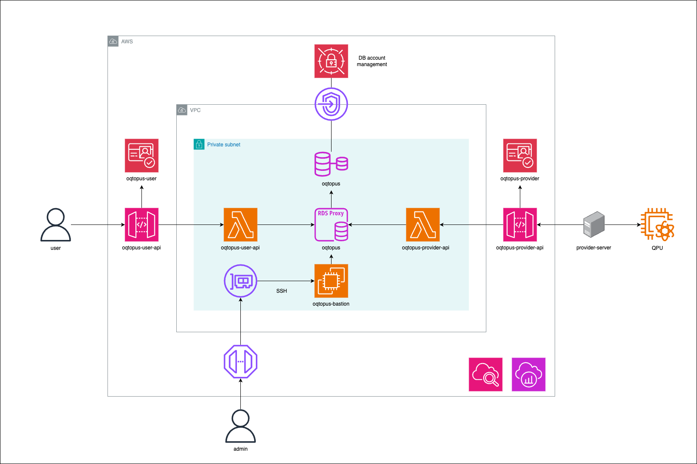

<h1> 🐙 OQTOPUS Cloud </h1>

  

## Overview

**O**pen **Q**uantum **T**oolchain for **OP**erators & **US**ers (**OQTOPUS**) is a project that provides the architecture of cloud quantum computers as an open-source software (OSS).
By using it in conjunction with various OSS provided by [@oqtopus-team](https://github.com/oqtopus-team), you can build a cloud quantum computer system.

## Features

- **Quantum Computing as a Service (QCaaS)**: Provides a cloud quantum computer system.
- **Quantum Task Management**: Manages quantum tasks and their states.
- **Quantum Device Management**: Manages quantum devices and their states.

## Documentation

- [Documentation Home](https://oqtopus-cloud.readthedocs.io/)

## CITATION

You can use the DOI to cite OQTOPUS Cloud in your research.

Citation information is also available in the [CITATION](https://github.com/oqtopus-team/oqtopus-cloud/blob/main/CITATION.cff) file.

## Contact

You can contact us by creating an issue in this repository,
or you can contact us by email:

- [oqtopus-team[at]googlegroups.com](mailto:oqtopus-team[at]googlegroups.com)

## LICENSE

OQTOPUS Cloud is released under the [Apache License 2.0](https://github.com/oqtopus-team/oqtopus-cloud/blob/main/LICENSE).
