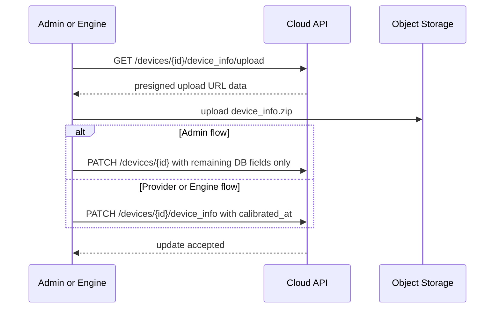

# Device Info in Detail

OQTOPUS stores device calibration payloads in object storage and exposes them through presigned URLs instead of returning inline JSON from the API.
The database keeps device metadata such as `device_type`, `status`, `n_qubits`, and `calibrated_at`, while the actual `device_info` payload lives in a storage-backed archive.

This page describes the current backend behavior and the storage conventions used by the surrounding clients. It follows the running implementation and OpenAPI files under `backend/oas`.

## Storage Model

Each device owns a deterministic storage key:

```text
devices/<device_id>/device_info.zip
```

The object key is fixed by the backend. Clients conventionally upload a zip containing a single `device_info.json` entry, but the backend validates the object key, not the filename inside the archive.

| Object | Conventional archive entry name | Producer | Consumer | Payload format | Notes |
| --- | --- | --- | --- | --- | --- |
| `devices/<device_id>/device_info.zip` | `device_info.json` | Admin client, Provider, Engine | Admin, User, SDKs | Device JSON payload | The only storage-backed device payload currently supported. |

The default storage driver is S3. Self-hosted deployments and local development can use `local` or `seaweedfs` — `local:minio` is planned for removal and remains available as a deprecated driver during migration to SeaweedFS, see [Storage Backend Selection](storage_backend_selection.md) — but the API contract is the same: the API returns upload presigned URL data or download presigned URLs, and clients transfer the archive directly to the storage backend.

At the OpenAPI level, the payload format inside `device_info.zip` is not defined as a structured schema. Admin-side request models treat `device_info` as a JSON string, while read-side APIs expose `device_info` as a string field containing a presigned download URL.

## Read Model

`GET /devices` and `GET /devices/{device_id}` in both the Admin API and User API return `device_info` as a download presigned URL when `devices/<device_id>/device_info.zip` exists.
If the object does not exist, `device_info` is `null` even when the device row itself exists.

The backend does not store the storage key in the `devices` table. It reconstructs the key from `device_id` every time by using the fixed `devices/<device_id>/device_info.zip` convention.

## Admin API Flow

The current Admin API is a two-step storage-backed flow:

1. Register or update the device row in the database.
   `POST /devices` creates the row, and `PATCH /devices/{device_id}` updates DB-backed metadata such as `status`, `n_qubits`, and `description`.
2. Request an upload target with `GET /devices/{device_id}/device_info/upload`.
   The backend returns presigned URL data for `devices/<device_id>/device_info.zip`.
3. Upload `device_info.zip` directly to storage.
4. Optionally send `PATCH /devices/{device_id}` for any remaining DB-backed metadata such as `calibrated_at` or `description`.
   The uploaded `device_info.zip` itself is already the source of truth for subsequent reads, so the admin client does not need to echo `device_info` back in the PATCH body.

The current admin frontend uploads `device_info.zip` first and then PATCHes only the DB-backed fields that still need to change.

For backward compatibility, `POST /devices` still derives `device_id` from the inline `device_info` JSON in the request body. However, the inline JSON itself is not persisted as the read-model source of truth. After registration, API responses expose only the storage-backed object URL.

The update sequence is short, but the final API step differs between the Admin flow and the Provider/Engine flow:



## Provider and Engine Flow

Provider-side uploads follow the same storage convention but use a dedicated confirmation endpoint:

1. Request an upload target with `GET /devices/{device_id}/device_info/upload` on the Provider API.
2. Upload `device_info.zip` directly to storage.
3. Confirm the upload with `PATCH /devices/{device_id}/device_info` and a `calibrated_at` timestamp.

The engine uses this flow through the provider API. On startup, `DeviceGatewayFetcher` performs an initial fetch from the device gateway and calls the device repository update sequence. If device-info updates are enabled, the repository:

1. requests a presigned upload target,
2. uploads `devices/<device_id>/device_info.zip`,
3. calls `PATCH /devices/{device_id}/device_info` with `calibrated_at`.

After startup, the same upload flow runs again whenever the fetched `device_info` payload or `calibrated_at` changes.

## Overwrite and Delete Semantics

Because the storage key is deterministic, uploading a new archive for the same `device_id` overwrites the previous object. The latest successful upload becomes the new source of truth.

`DELETE /devices/{device_id}` in the Admin API removes both:

- the database row in `devices`, and
- the storage object `devices/<device_id>/device_info.zip` if it exists.

This keeps device cleanup from leaving orphaned storage objects behind.

## Example Archive Layout

```text
devices/qulacs/device_info.zip
  device_info.json
```

## Implementation Notes

- `device_info` is storage-backed on reads. API responses expose a download presigned URL, not the raw JSON payload.
- The OpenAPI files do not define a typed schema for the contents of `device_info` itself. The write-side contract is effectively “JSON serialized into a string”, and the read-side contract is “string URL to the archived payload”.
- The Admin API PATCH contract is metadata-only. The current admin client uploads `device_info.zip` separately and does not send `device_info` back in `PATCH /devices/{device_id}`.
- `calibrated_at` remains in the `devices` table and is updated separately from the object upload confirmation.
- Upload presigned URLs expire according to the storage strategy; the current default in `FSSpecStorage` is one hour.
- The backend validates object existence, not the archive entry name inside `device_info.zip`.
- Recreating a device row does not recreate `device_info.zip`; a provider/admin upload or an engine startup sync is required to restore the object.
