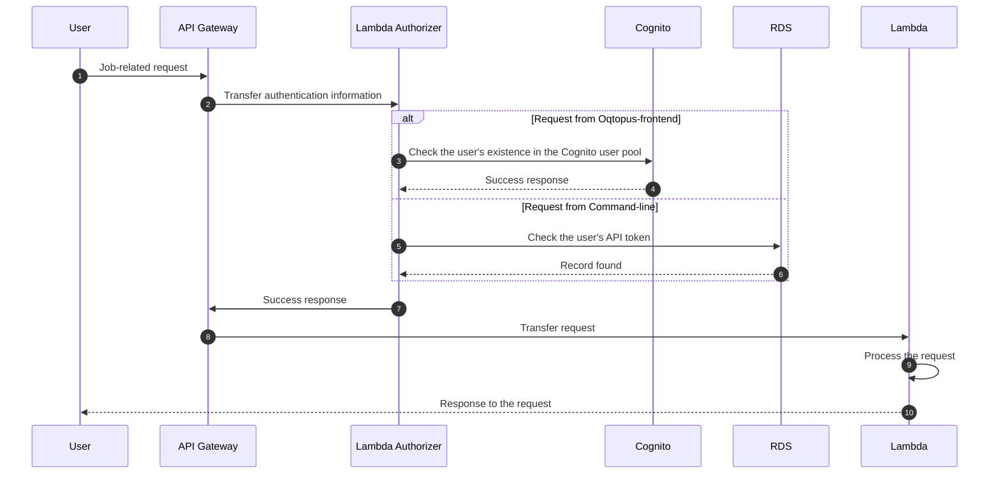

# Authentication Sequence of User Operations

This page shows the sequence diagram of authentication of users.

## User Job-related Requests (Success Case)

This sequence diagram shows the authentication procedure when the user makes a request.

