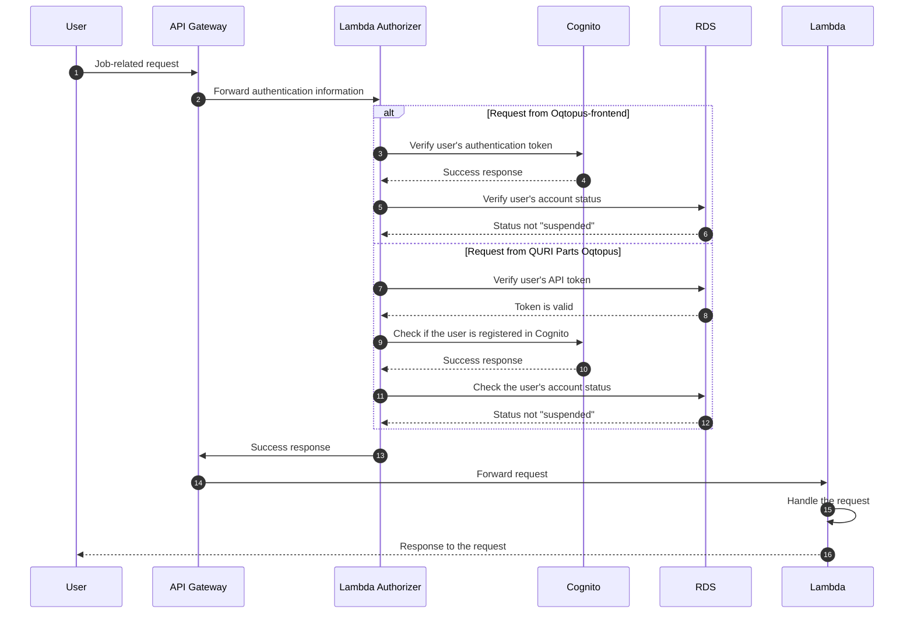

# Authentication Sequence of User Operations

This page shows the sequence diagram of authentication of users.

## User Job-related Requests (Success Case)

This sequence diagram shows the authentication procedure when the user makes a request.

The supported requests include the following:

- Job Operations:
  - GET Jobs: Retrieve a list of jobs.
  - GET Job Detail: Retrieve details of a specific job.
  - POST Job (Register): Submit a new job.
  - POST Job (Cancel): Request the cancellation of a job.
  - DELETE Job: Remove a job.
- Device Operations:
  - GET Devices: Retrieve a list of devices.
  - GET Device Detail: Retrieve details of a specific device.
- Status and Logs:
  - GET Job Status: Retrieve the current status of a job.
  - GET SSE Log: Retrieve the log of SSE job.
- API Token Operations:
  - GET API Token: Retrieve the current API token.
  - POST API Token: Create a new API token and overwrite existing one.
  - DELETE API Token: Delete an existing API token.

