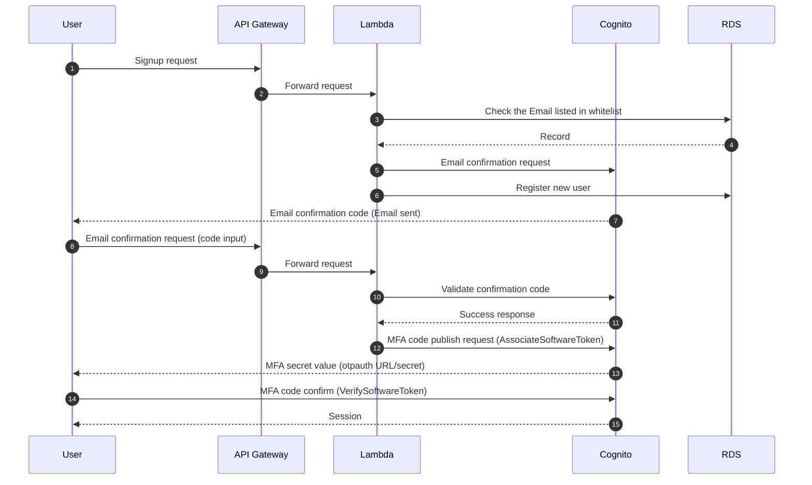
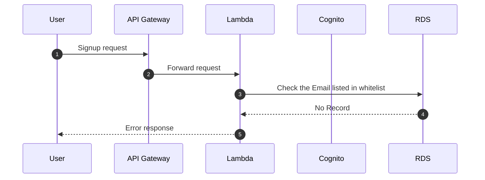
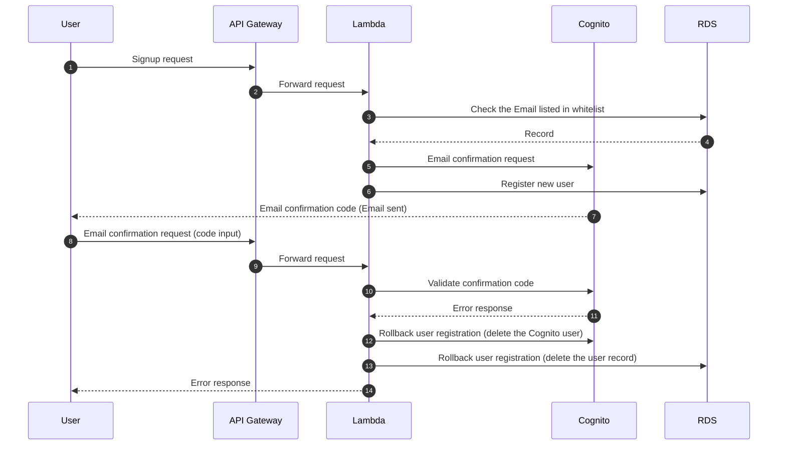
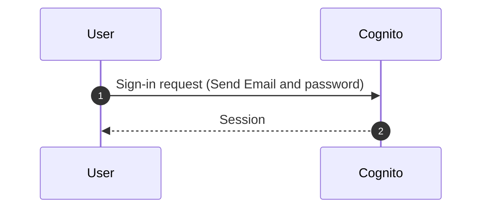
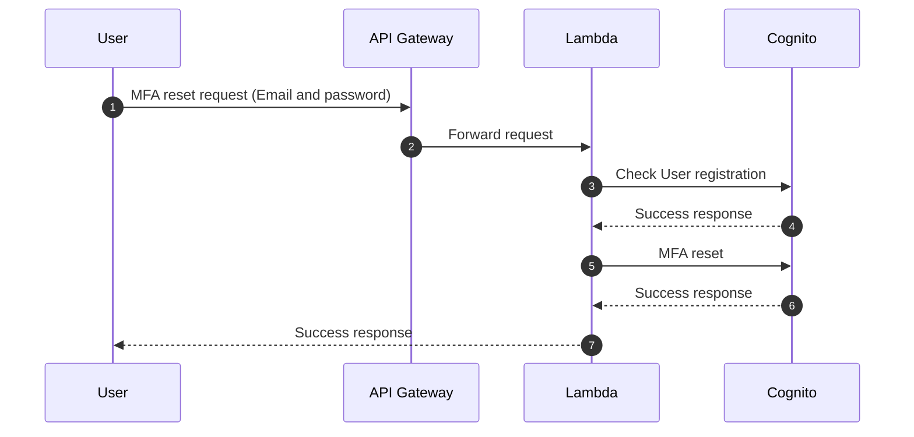
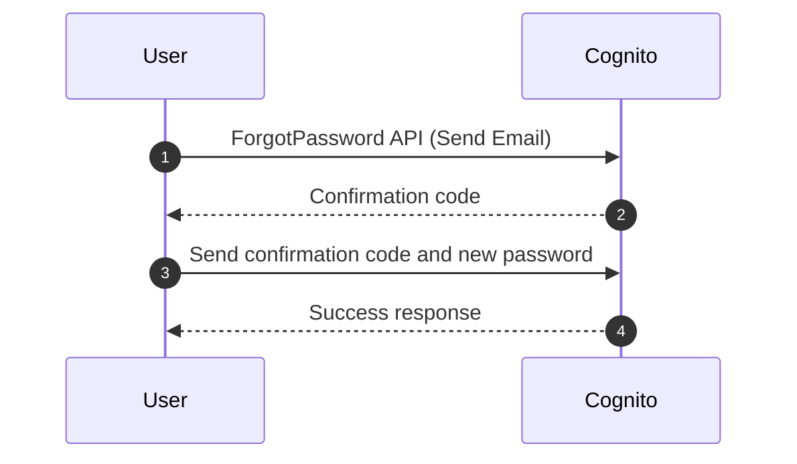

# Sign-up and Sign-in Sequence Diagrams

This page shows a sequence diagram of user sign-up, sign-in, MFA reset, and password reset procedures.

## User Sign-up Sequence (Success case)

The following sequence diagram shows successful user registration: the API Gateway and Lambda function are between the user and Cognito user pool, ensuring the user is whitelisted.

## User Sign-up Sequence (Email not in whitelist failure case)

The following sequence diagram shows the case where the user is not listed in the whitelist.

## User Sign-up Sequence (Email confirmation failure case)

The following sequence diagram shows the the case where the user failed to validate the confirmation code.

## User Sign-in Sequence

The brief sequence diagram shows the sign-in procedure. No intermidiate service like API Gateway and Lambda exists.

## User MFA Reset Sequence

The following sequence diagram shows the MFA reset procedure. The user can reset the MFA device anytime if the Email and the password match.

## Sequence of Password Reset

The following sequence diagram shows a user resetting a password.

