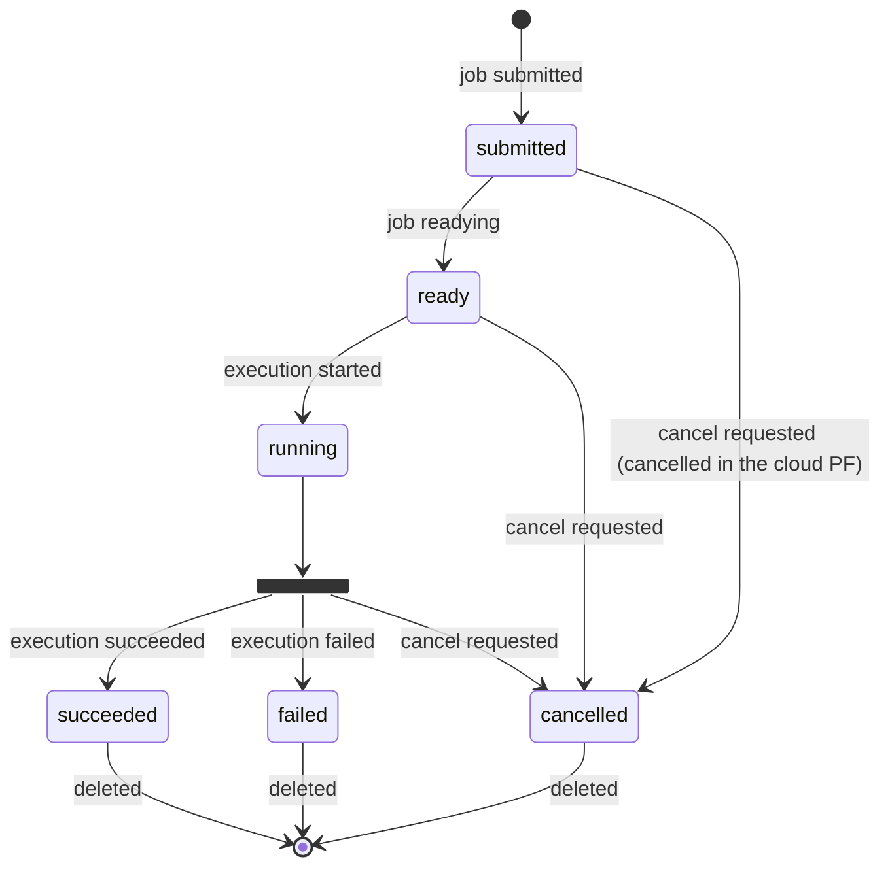

# Job State Transition

A job can have the following states.

- **`submitted`**
  The state when the user has submitted a job to OQTOPUS Cloud.
- **`ready`**
  The state when the backend retrieves the job via the OQTOPUS Cloud Provider API.
  At this stage, the backend holds the job, but it has not yet been executed on a QPU or simulator.
- **`running`**
  The state when the job is being executed on a QPU or simulator.
- **`succeeded`**
  The state when the job has completed successfully.
- **`failed`**
  The state when the job has failed due to an error.
- **`cancelled`**
  The state when the job execution has been canceled.

The following diagram shows the job state transitions.

