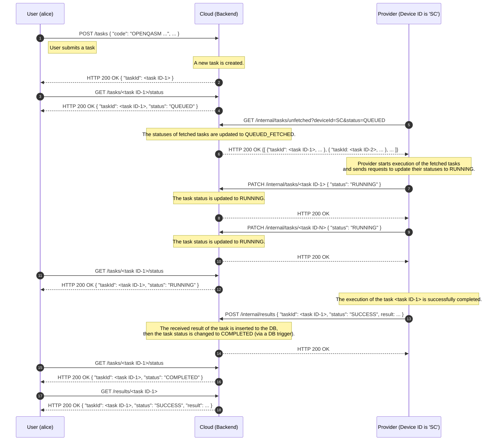
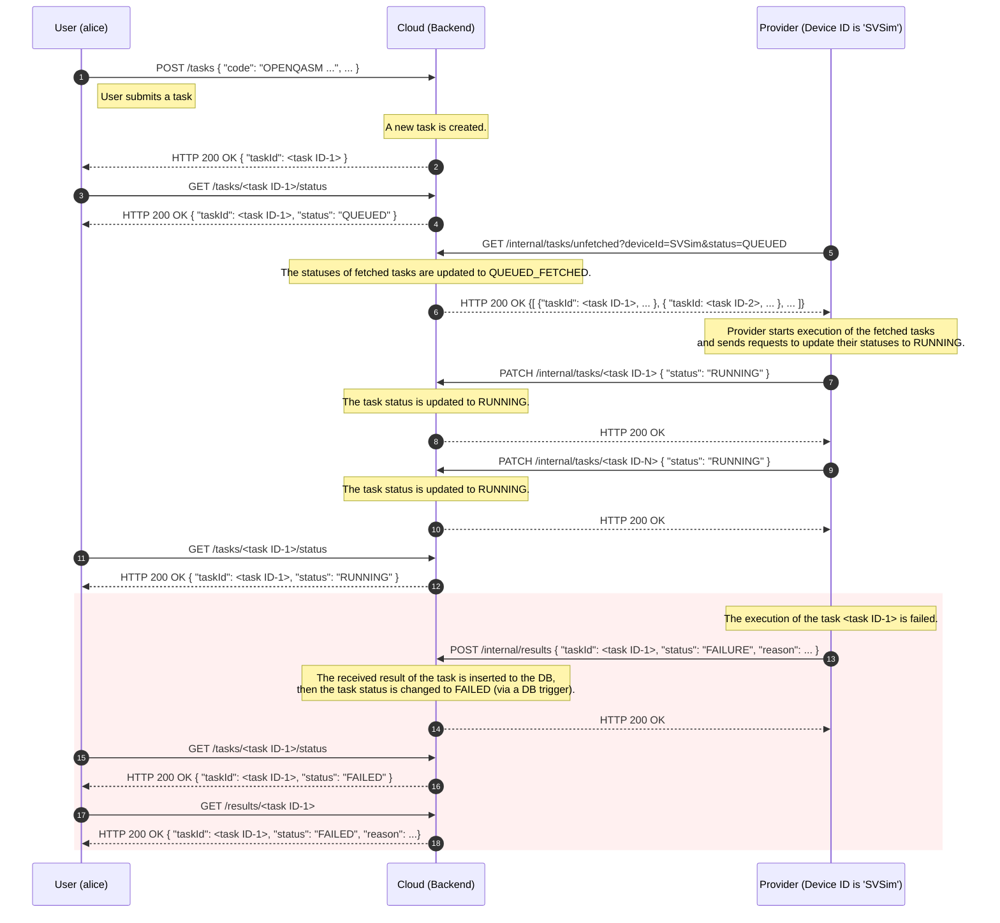
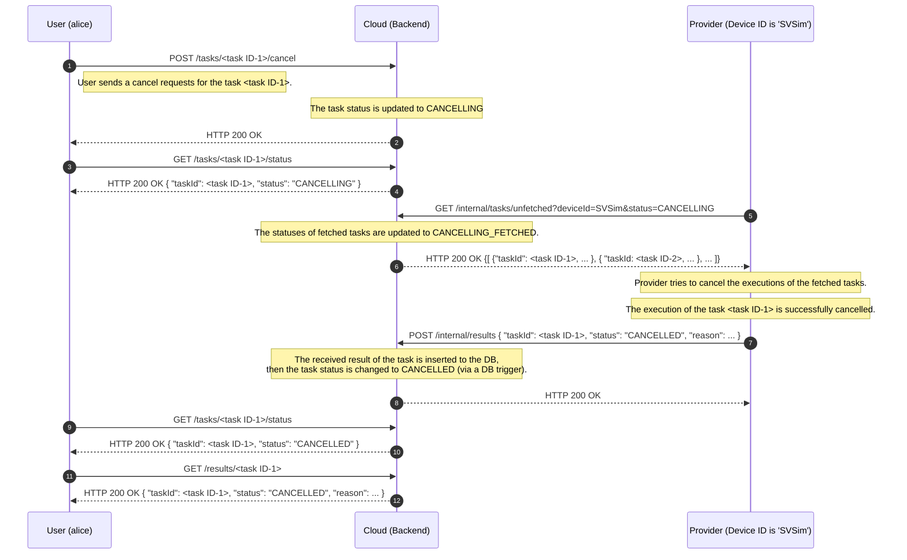

# Sequences of Task Operations

This page shows behavioral sequences of task operations.
Each sequence shows a series of steps from sending a request of task execution or cancellation to the completion of the operations.

> [!NOTE]
> The `/tasks`, `/tasks/{taskId}/cancel`, and `/results` endpoints in the following sequence diagrams are actually implemented as separate endpoints specific to sampling and estimation tasks.
> For example, `/tasks` is actually implemented as `/tasks/sampling` and `/tasks/estimation`.
> The path part `/sampling` or `/estimation` is omitted in the sequence diagrams because the behavioral sequences of the both endpoints are the same.

## Sequence of Task Execution (Success Case)

The following shows a sequence of successful task execution.
It shows the steps of task submission by User, task fetch and execution by Provider, and retrieval of the execution result by User.

Provider periodically repeats the process of fetching tasks, executing the tasks, and sending the results.
The above diagram shows one iteration of the repeated process.

> [!NOTE]
> Cloud exposes the information on whether a task is fetched (i.e., whether the status has the suffix of _FETCHED) to Provider only; Cloud does not expose it to User.
> For example, if User requests information of a task in QUEUED_FETCHED status from Cloud, the value of the task status is QUEUED in the response from Cloud.
> In contrast, the value of the task status is QUEUED_FETCHED in a response to Provider.

### Data in the DB at Each Time Point

The followings show sample data in the DB at each point in the sequence diagram,
where there is one task submission to each of the two endpoints, `/tasks/sampling` and `/tasks/estimation`.
The numbers below correspond to the circled numbers in the sequence diagram.

- (2)
  - tasks table: [success-case-tasks-02.csv](../../sample/architecture/success-case-tasks-02.csv)
  - results table: no data
- (6)
  - tasks table: [success-case-tasks-06.csv](../../sample/architecture/success-case-tasks-06.csv)
  - results table: no data
- (10)
  - tasks table: [success-case-tasks-10.csv](../../sample/architecture/success-case-tasks-10.csv)
  - results table: no data
- (14)
  - tasks table: [success-case-tasks-14.csv](../../sample/architecture/success-case-tasks-14.csv)
  - results table: [success-case-results-14.csv](../../sample/architecture/success-case-results-14.csv)

## Sequence of Task Execution (Failure Case)

The following shows a sequence in which a task execution fails.
Each step from the beginning until the task status is changed to RUNNING is the same as in the success case.
The colored part shows steps specific to the failure case.

### Data in the DB at Each Time Point

The followings show sample data in the DB at each point in the sequence diagram,
where there is one task submission to the endpoint `/tasks/estimation`.
The numbers below correspond to the circled numbers in the sequence diagram.

- (2), (6), (10)
  - Omitted, as they are the same as in the successful case.
- (14)
  - tasks table: [failure-case-tasks-14.csv](../../sample/architecture/failure-case-tasks-14.csv)
  - results table: [failure-case-tasks-14.csv](../../sample/architecture/failure-case-results-14.csv)

## Sequence of Task Cancellation

The following shows a sequence of task cancellation,
where User tries to cancel a task when the task in the DB is in QUEUED_FETCHED status.

Provider periodically repeats the process of fetching cancel requests (i.e., tasks in CANCELLING status), cancelling task executions, and sending the cancellation results.
The above diagram shows one iteration of the repeated process.

### Data in the DB at Each Time Point

The followings show sample data in the DB at each point in the sequence diagram,
where there is one cancellation request to the endpoint `/tasks/sampling/{taskId}/cancel` when the task in the DB is QUEUED_FETCHED status.
The numbers below correspond to the circled numbers in the sequence diagram.

- (1)
  - tasks table: [cancel-case-tasks-01.csv](../../sample/architecture/cancel-case-tasks-01.csv)
  - results table: no data
- (2)
  - tasks table: [cancel-case-tasks-02.csv](../../sample/architecture/cancel-case-tasks-02.csv)
  - results table: no data
- (6)
  - tasks table: [cancel-case-tasks-06.csv](../../sample/architecture/cancel-case-tasks-06.csv)
  - results table: no data
- (8)
  - tasks table: [cancel-case-tasks-08.csv](../../sample/architecture/cancel-case-tasks-08.csv)
  - results table: [cancel-case-results-08.csv](../../sample/architecture/cancel-case-results-08.csv)

> [!NOTE]
> If the task is in QUEUED status (i.e., before Provider fetches the task) at (1), Cloud immediately changes the task status to CANCELLED.
> It means the task state transitions from (1) to (8) directly.
> In this case, the task is never fetched by Provider.
