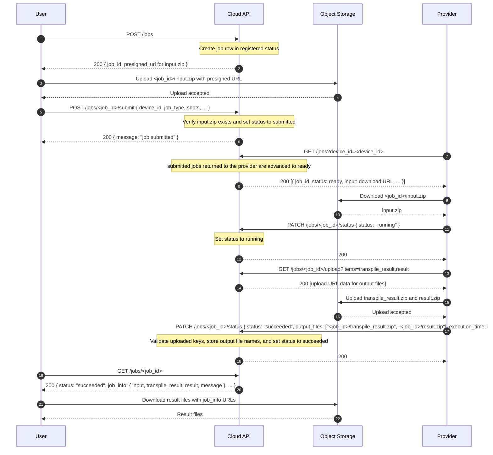
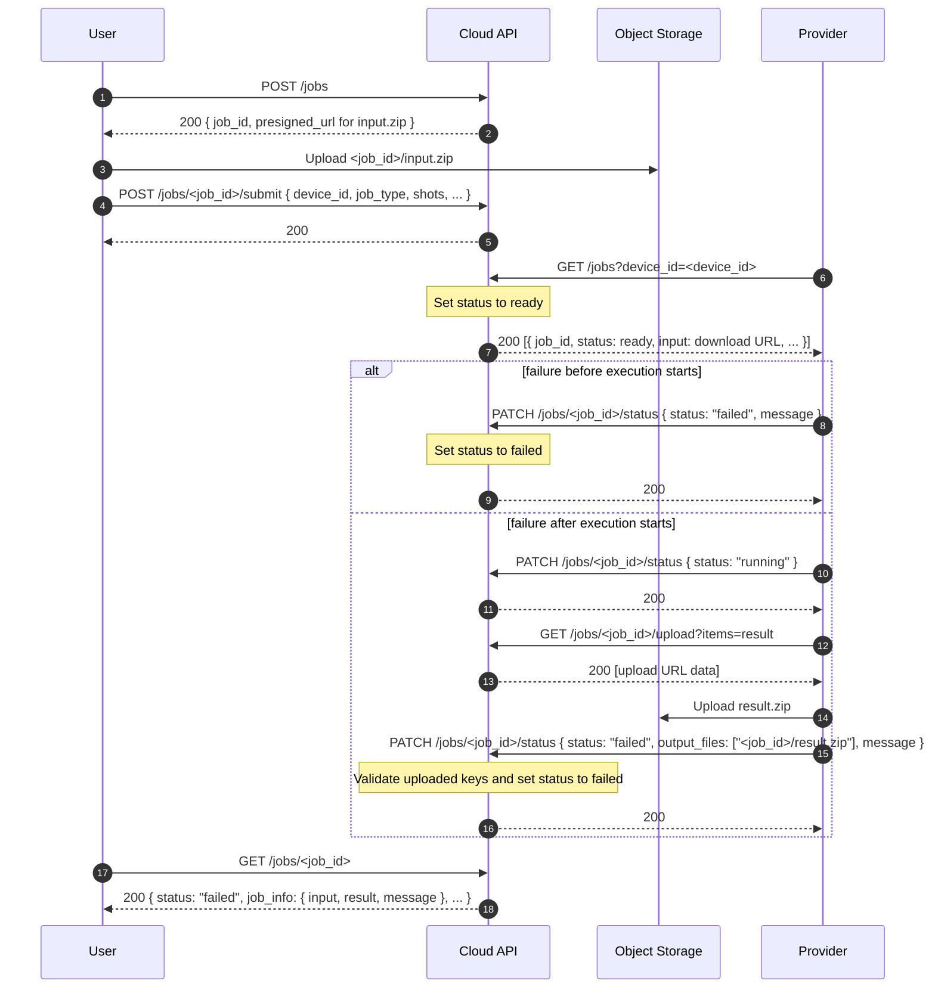
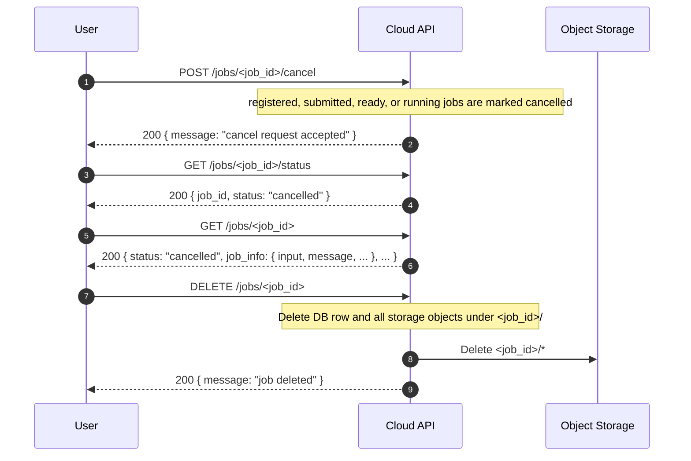

# Sequences of Job Operations

This page shows the current job-operation sequences.
Large job inputs and outputs are transferred through object storage with presigned URLs, while the Cloud API stores and updates job metadata.

## Sequence of Job Execution (Success Case)

```mermaid
sequenceDiagram
    autonumber
    participant User as User
    participant Cloud as Cloud API
    participant Storage as Object Storage
    participant Provider as Provider

    User->>Cloud: POST /jobs
    Note over Cloud: Create job row in registered status
    Cloud-->>User: 200 { job_id, presigned_url for input.zip }

    User->>Storage: Upload <job_id>/input.zip with presigned URL
    Storage-->>User: Upload accepted

    User->>Cloud: POST /jobs/<job_id>/submit { device_id, job_type, shots, ... }
    Note over Cloud: Verify input.zip exists and set status to submitted
    Cloud-->>User: 200 { message: "job submitted" }

    Provider->>Cloud: GET /jobs?device_id=<device_id>
    Note over Cloud: submitted jobs returned to the provider are advanced to ready
    Cloud-->>Provider: 200 [{ job_id, status: ready, input: download URL, ... }]

    Provider->>Storage: Download <job_id>/input.zip
    Storage-->>Provider: input.zip

    Provider->>Cloud: PATCH /jobs/<job_id>/status { status: "running" }
    Note over Cloud: Set status to running
    Cloud-->>Provider: 200

    Provider->>Cloud: GET /jobs/<job_id>/upload?items=transpile_result,result
    Cloud-->>Provider: 200 [upload URL data for output files]

    Provider->>Storage: Upload transpile_result.zip and result.zip
    Storage-->>Provider: Upload accepted

    Provider->>Cloud: PATCH /jobs/<job_id>/status { status: "succeeded", output_files: ["<job_id>/transpile_result.zip", "<job_id>/result.zip"], execution_time, message }
    Note over Cloud: Validate uploaded keys, store output file names, and set status to succeeded
    Cloud-->>Provider: 200

    User->>Cloud: GET /jobs/<job_id>
    Cloud-->>User: 200 { status: "succeeded", job_info: { input, transpile_result, result, message }, ... }

    User->>Storage: Download result files with job_info URLs
    Storage-->>User: Result files
```

Provider polling advances jobs from `submitted` to `ready`. A provider then explicitly changes `ready` to `running`, uploads output files to storage, and reports the uploaded keys when setting a terminal status.

## Sequence of Job Execution (Failure Case)

The flow is the same as the success case until the provider reports failure.
The Provider API accepts failure from either `ready` or `running`, which allows preprocessing failures to be reported before execution starts.

```mermaid
sequenceDiagram
    autonumber
    participant User as User
    participant Cloud as Cloud API
    participant Storage as Object Storage
    participant Provider as Provider

    User->>Cloud: POST /jobs
    Cloud-->>User: 200 { job_id, presigned_url for input.zip }
    User->>Storage: Upload <job_id>/input.zip
    User->>Cloud: POST /jobs/<job_id>/submit { device_id, job_type, shots, ... }
    Cloud-->>User: 200

    Provider->>Cloud: GET /jobs?device_id=<device_id>
    Note over Cloud: Set status to ready
    Cloud-->>Provider: 200 [{ job_id, status: ready, input: download URL, ... }]

    alt failure before execution starts
        Provider->>Cloud: PATCH /jobs/<job_id>/status { status: "failed", message }
        Note over Cloud: Set status to failed
        Cloud-->>Provider: 200
    else failure after execution starts
        Provider->>Cloud: PATCH /jobs/<job_id>/status { status: "running" }
        Cloud-->>Provider: 200
        Provider->>Cloud: GET /jobs/<job_id>/upload?items=result
        Cloud-->>Provider: 200 [upload URL data]
        Provider->>Storage: Upload result.zip
        Provider->>Cloud: PATCH /jobs/<job_id>/status { status: "failed", output_files: ["<job_id>/result.zip"], message }
        Note over Cloud: Validate uploaded keys and set status to failed
        Cloud-->>Provider: 200
    end

    User->>Cloud: GET /jobs/<job_id>
    Cloud-->>User: 200 { status: "failed", job_info: { input, result, message }, ... }
```

Failure details are returned through `job_info.message`. If the provider uploads diagnostic output files and includes them in `output_files`, the User API exposes download presigned URLs for those files.

## Sequence of Job Cancellation

```mermaid
sequenceDiagram
    autonumber
    participant User as User
    participant Cloud as Cloud API
    participant Storage as Object Storage

    User->>Cloud: POST /jobs/<job_id>/cancel
    Note over Cloud: registered, submitted, ready, or running jobs are marked cancelled
    Cloud-->>User: 200 { message: "cancel request accepted" }

    User->>Cloud: GET /jobs/<job_id>/status
    Cloud-->>User: 200 { job_id, status: "cancelled" }

    User->>Cloud: GET /jobs/<job_id>
    Cloud-->>User: 200 { status: "cancelled", job_info: { input, message, ... }, ... }

    User->>Cloud: DELETE /jobs/<job_id>
    Note over Cloud: Delete DB row and all storage objects under <job_id>/
    Cloud->>Storage: Delete <job_id>/*
    Cloud-->>User: 200 { message: "job deleted" }
```

Users can request cancellation while the job is `registered`, `submitted`, `ready`, or `running`.
Deletion is allowed only after a job reaches `succeeded`, `failed`, or `cancelled`.
