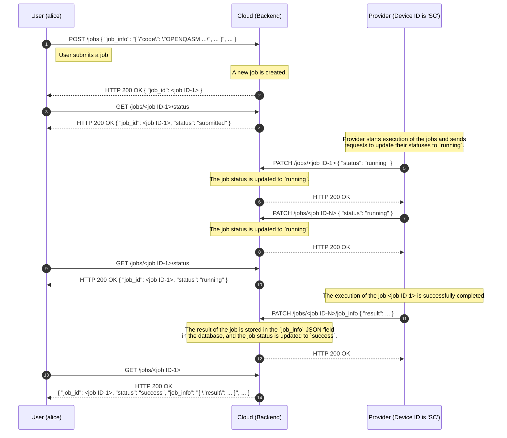
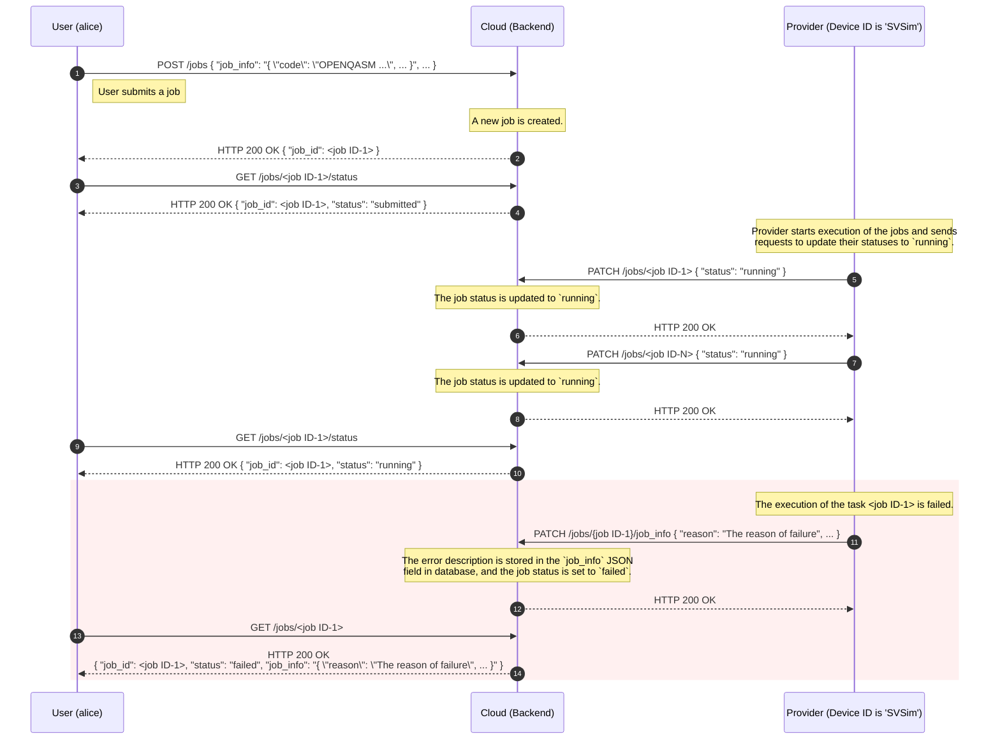
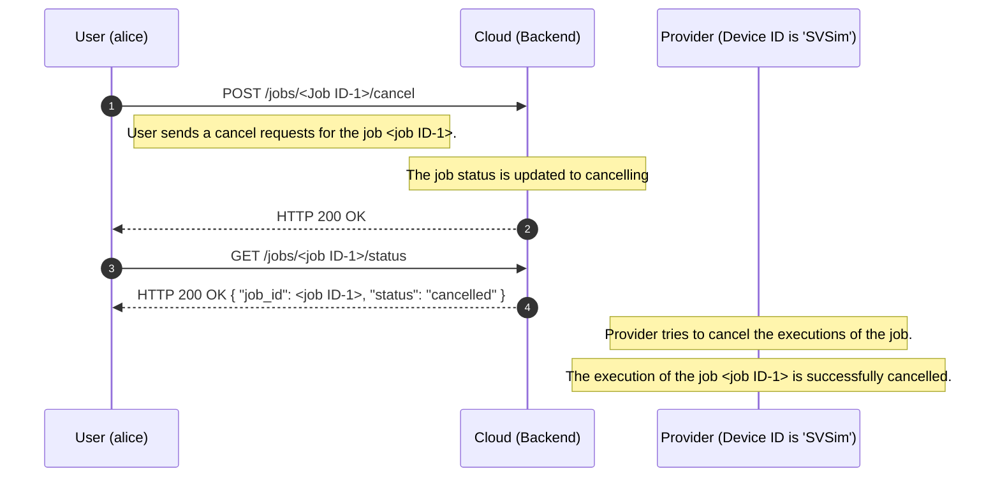

# Sequences of Job Operations

This page shows behavioral sequences of task operations.
Each sequence shows a series of steps from sending a request of job execution or cancellation to the completion of the operations.

## Sequence of Job Execution (Success Case)

The following shows a sequence of successful job execution.
It shows the steps of job submission by User, job execution by Provider, and retrieval of the execution result by User.

```mermaid
sequenceDiagram
    autonumber
    participant User as User (alice)
    participant Cloud as Cloud (Backend)
    participant Provider as Provider (Device ID is 'SC')

    User->>Cloud: POST /jobs { "job_info": "{ \"code\": \"OPENQASM ...\", ... }", ... }
    Note right of User: User submits a job
    Note over Cloud: A new job is created.
    Cloud-->>User: HTTP 200 OK { "job_id": <job ID-1> }

    User->>Cloud: GET /jobs/<job ID-1>/status
    Cloud-->>User: HTTP 200 OK { "job_id": <job ID-1>, "status": "submitted" }

    Note over Provider: Provider starts execution of the jobs and sends <br/>  requests to update their statuses to `running`.
    Provider->>Cloud: PATCH /jobs/<job ID-1> { "status": "running" }
    Note over Cloud: The job status is updated to `running`.
    Cloud-->>Provider: HTTP 200 OK

    Provider->>Cloud: PATCH /jobs/<job ID-N> { "status": "running" }
    Note over Cloud: The job status is updated to `running`.
    Cloud-->>Provider: HTTP 200 OK

    User->>Cloud: GET /jobs/<job ID-1>/status
    Cloud-->>User: HTTP 200 OK { "job_id": <job ID-1>, "status": "running" }

    Note over Provider: The execution of the job <job ID-1> is successfully completed.
    Provider->>Cloud: PATCH /jobs/<job ID-N>/job_info { "result": ... }

    Note over Cloud: The result of the job is stored in the `job_info` JSON field<br /> in the database, and the job status is updated to `success`.
    Cloud-->>Provider: HTTP 200 OK

    User->>Cloud: GET /jobs/<job ID-1>
    Cloud-->>User: HTTP 200 OK <br>{ "job_id": <job ID-1>, "status": "success", "job_info": "{ \"result\": ... }", ... } 
```

Provider periodically repeats the process of executing the jobs and writting the results.
The above diagram shows one iteration of the repeated process.

Each sequence shows a series of steps from sending a request of task execution or cancellation to the completion of the operations.

> [!NOTE]
> The `job_info` field in the job is a JSON serialized string.

### Data in the DB at Each Time Point

The followings show sample data in the database at each point in the sequence diagram,
where there is one job submission to each of the two endpoints, `/tasks/sampling` and `/tasks/estimation`.
The numbers below correspond to the circled numbers in the sequence diagram.

- (2)
  - tasks table: [success-case-tasks-02.csv](../../sample/architecture/success-case-tasks-02.csv)
  - results table: no data
- (8)
  - tasks table: [success-case-tasks-10.csv](../../sample/architecture/success-case-tasks-10.csv)
  - results table: no data
- (12)
  - tasks table: [success-case-tasks-14.csv](../../sample/architecture/success-case-tasks-14.csv)
  - results table: [success-case-results-14.csv](../../sample/architecture/success-case-results-14.csv)

## Sequence of Job Execution (Failure Case)

The following shows a sequence in which a job execution fails.
Each step from the beginning until the job status is changed to `running` is the same as in the success case.
The colored part shows steps specific to the failure case.

```mermaid
sequenceDiagram
    autonumber
    participant User as User (alice)
    participant Cloud as Cloud (Backend)
    participant Provider as Provider (Device ID is 'SVSim')

    User->>Cloud: POST /jobs { "job_info": "{ \"code\": \"OPENQASM ...\", ... }", ... }

    Note right of User: User submits a job
    Note over Cloud: A new job is created.
    Cloud-->>User: HTTP 200 OK { "job_id": <job ID-1> }

    User->>Cloud: GET /jobs/<job ID-1>/status
    Cloud-->>User: HTTP 200 OK { "job_id": <job ID-1>, "status": "submitted" }

    Note over Provider: Provider starts execution of the jobs and sends <br/>  requests to update their statuses to `running`.
    Provider->>Cloud: PATCH /jobs/<job ID-1> { "status": "running" }
    Note over Cloud: The job status is updated to `running`.
    Cloud-->>Provider: HTTP 200 OK

    Provider->>Cloud: PATCH /jobs/<job ID-N> { "status": "running" }
    Note over Cloud: The job status is updated to `running`.
    Cloud-->>Provider: HTTP 200 OK

    User->>Cloud: GET /jobs/<job ID-1>/status
    Cloud-->>User: HTTP 200 OK { "job_id": <job ID-1>, "status": "running" }

    rect rgb(255, 240, 240)
        Note over Provider: The execution of the task <job ID-1> is failed.
        Provider->>Cloud: PATCH /jobs/{job ID-1}/job_info { "reason": "The reason of failure", ... }
        Note over Cloud: The error description is stored in the `job_info` JSON <br />field in database, and the job status is set to `failed`.
        Cloud-->>Provider: HTTP 200 OK
  
        User->>Cloud: GET /jobs/<job ID-1>
        Cloud-->>User: HTTP 200 OK <br />{ "job_id": <job ID-1>, "status": "failed", "job_info": "{ \"reason\": \"The reason of failure\", ... }" }
    end
```

### Data in the DB at Each Time Point

The followings show sample data in the DB at each point in the sequence diagram,
where there is one task submission to the endpoint `/tasks/estimation`.
The numbers below correspond to the circled numbers in the sequence diagram.

- (2), (6), (8)
  - Omitted, as they are the same as in the successful case.
- (12)
  - tasks table: [failure-case-tasks-14.csv](../../sample/architecture/failure-case-tasks-14.csv)
  - results table: [failure-case-tasks-14.csv](../../sample/architecture/failure-case-results-14.csv)

## Sequence of Job Cancellation

The following shows a sequence of job cancellation,
where User tries to cancel a job.

```mermaid
sequenceDiagram
    autonumber
    participant User as User (alice)
    participant Cloud as Cloud (Backend)
    participant Provider as Provider (Device ID is 'SVSim')

    User->>Cloud: POST /jobs/<Job ID-1>/cancel
    Note right of User: User sends a cancel requests for the job <job ID-1>.
    Note over Cloud: The job status is updated to cancelling
    Cloud-->>User: HTTP 200 OK

    User->>Cloud: GET /jobs/<job ID-1>/status
    Cloud-->>User: HTTP 200 OK { "job_id": <job ID-1>, "status": "cancelled" }

    Note over Provider: Provider tries to cancel the executions of the job.
    Note over Provider: The execution of the job <job ID-1> is successfully cancelled.
```

Provider periodically repeats the process of cancelling job executions and sending the cancellation results.
The above diagram shows one iteration of the repeated process.

### Data in the DB at Each Time Point

The followings show sample data in the DB at each point in the sequence diagram,
where there is one cancellation request to the endpoint `/jobs/{job ID}/cancel`.
The numbers below correspond to the circled numbers in the sequence diagram.

- (1)
  - tasks table: [cancel-case-jobs-01.csv](../../sample/architecture/cancel-case-tasks-01.csv)
  - results table: no data
- (2)
  - tasks table: [cancel-case-jobs-02.csv](../../sample/architecture/cancel-case-tasks-02.csv)
  - results table: no data
- (6)
  - tasks table: [cancel-case-jobs-08.csv](../../sample/architecture/cancel-case-tasks-08.csv)
  - results table: [cancel-case-results-08.csv](../../sample/architecture/cancel-case-results-08.csv)

> [!NOTE]
> If the task is in QUEUED status at (1), Cloud immediately changes the task status to CANCELLED.
> It means the task state transitions from (1) to (6) directly.
