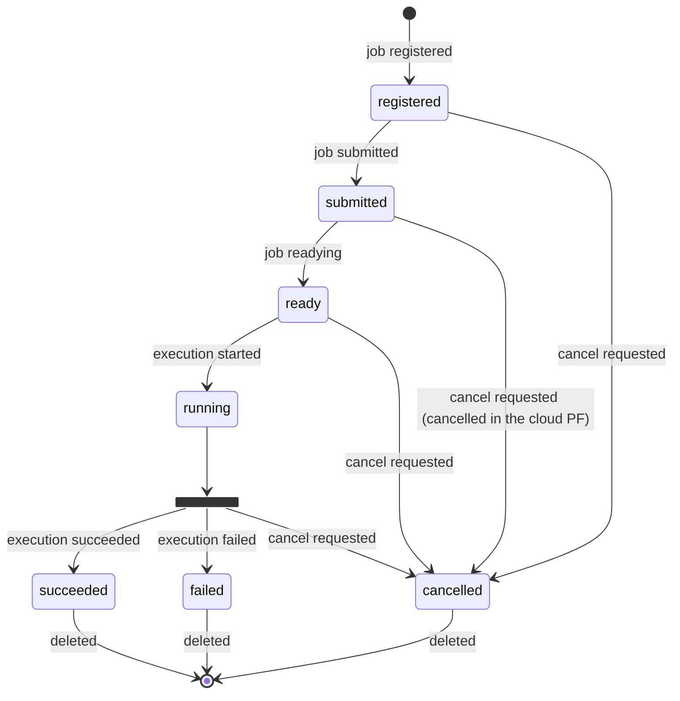

# Job State Transition

```mermaid
stateDiagram-v2
    [*] --> registered :job registered
    registered --> submitted :job submitted

    submitted --> ready : job readying
    ready --> running : execution started

    state join_state <<join>>
    running --> join_state

    state join_state <<fork>>
    join_state --> succeeded :execution succeeded
    join_state --> failed :execution failed
    join_state --> cancelled :cancel requested

    succeeded --> [*] :deleted
    failed --> [*] :deleted
    registered --> cancelled :cancel requested
    submitted --> cancelled :cancel requested (cancelled in the cloud PF)
    ready --> cancelled :cancel requested
    cancelled --> [*] :deleted
```
