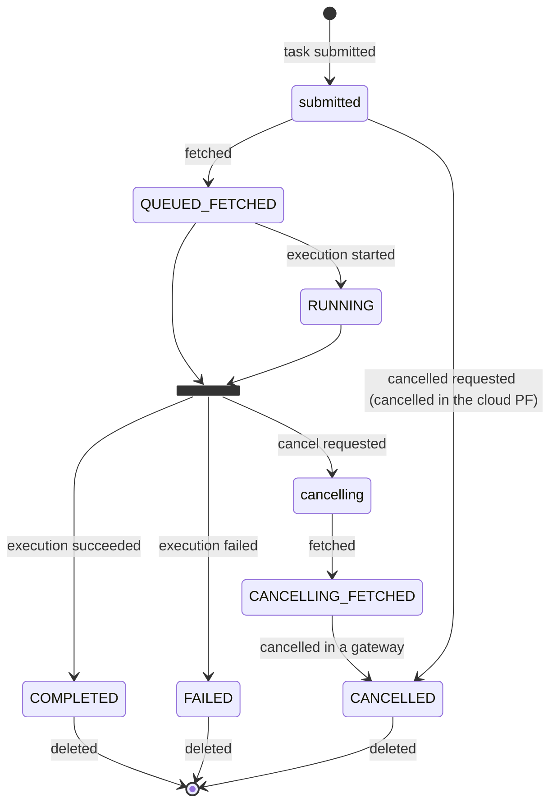

# Task State Transition

The time to stay in the RUNNING state can be very short, so it can be skipped.
For example, QUEUED_FETCHED tasks can be transitioned to COMPLETED directly.

```mermaid
stateDiagram-v2
  [*] --> submitted :task submitted

  submitted --> QUEUED_FETCHED :fetched
  QUEUED_FETCHED --> RUNNING :execution started
  
  state join_state <<join>>
  QUEUED_FETCHED --> join_state
  RUNNING --> join_state
  
  state join_state <<fork>>
  join_state --> COMPLETED :execution succeeded
  join_state --> FAILED :execution failed
  join_state --> cancelling :cancel requested
  
  COMPLETED --> [*] :deleted
  FAILED --> [*] :deleted
  cancelling --> CANCELLING_FETCHED :fetched
  CANCELLING_FETCHED --> CANCELLED :cancelled in a gateway
  submitted --> CANCELLED :cancelled requested (cancelled in the cloud PF)
  CANCELLED --> [*] :deleted
```
