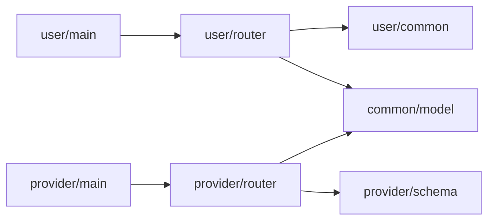

# Backend

## Technologies Used

The following technologies are used in OQTOPUS:

- FastAPI
- Uvicorn
- Mangum
- AWS Powertools
- Pydantic
- datamodel-code-generator
- SQLAlchemy

### FastAPI, Uvicorn & Mangum

Uvicorn is used as the WSGI server. Since Uvicorn is an ASGI server, it has high compatibility with FastAPI and allows for fast request processing.
Using Mangum, you can deploy FastAPI applications to AWS Lambda.

### AWS Powertools

AWS Powertools is a library for structuring logs in AWS Lambda, making log visualization and analysis easier.

### Pydantic & datamodel-code-generator

Pydantic is a data validation library used for validating request and response bodies in FastAPI.

datamodel-code-generator is a library that automatically generates Pydantic models from OpenAPI specifications, simplifying data model definitions.

### SQLAlchemy

SQLAlchemy is a Python ORM library that simplifies database operations.

## Code Dependencies

The following diagram shows the code dependencies of the Python project.



The entry point `main.py` uses FastAPI's `router` feature to route requests to the path operations under routers.

The router validates requests using request and response bodies defined in the schema. The database uses data models defined in the model to operate the database.

To keep code dependencies simple, follow these rules:

- `main.py` only refers to `router`.
- `schema` is used only in `router`.
- `schema` and `model` are always referred to, but do not depend on other code.

> [!NOTE]
> Since the schema is automatically generated by [datamodel-code-generator](https://koxudaxi.github.io/datamodel-code-generator/), do not modify it manually.
> For more details, refer to the [OpenAPI specifications](openapi.md).

## Linters & Formatters

OQTOPUS uses the following linters and formatters:

| Tool | Documentation |
|-------|--------------|
| ruff  | [Link](https://docs.astral.sh/ruff/) |
| black | [Link](https://black.readthedocs.io/en/stable/) |
| mypy  | [Link](https://mypy.readthedocs.io/en/stable/) |

Each of these is defined in the task runner in the Makefile, so please run them before pushing the code.

```makefile
# ./Makefile
fmt:
    @poetry run black .

lint:
    @poetry run ruff check .

test:fmt lint
    @poetry run pytest -vv --cov
```

## Tutorial

Let's go through a simple example to check the API development flow.

### Requirements

- Create an API to retrieve a task by specifying the task ID.

By automatically generating Pydantic models from OpenAPI specifications, you can prevent discrepancies from the specifications and streamline API development.
Let's implement the API.

### Implementing the Router

Implement the API to retrieve a task by specifying the task ID in `backend/oqtopus_cloud/user/router/task.py`.

```python
# backend/oqtopus_cloud/user/router/task.py
import uuid

from aws_lambda_powertools import Logger
from fastapi import (
    APIRouter,
    Depends,
    Path,
)
from pydantic import (
    ValidationError,
)
from sqlalchemy.orm import (
    Session,
)

from oqtopus_cloud.common.database.device import exist_device
from oqtopus_cloud.common.database.session import (
    get_db,
)
from oqtopus_cloud.common.database.task import (
    Task,
    TaskNotFound,
    fetch_task,
    insert_task,
)
from oqtopus_cloud.user.schemas.errors import BadRequest, InternalServerError, NotFoundError
from oqtopus_cloud.user.schemas.task import (
    GetTaskResponse,
    PostTaskRequest,
    TaskId,
)

router = APIRouter()

logger = Logger(service="mangum")
logger.setLevel("INFO")

# ...omitted

@router.get("/task/{task_id}")
def get_task(
    task_id: str = Path(
        title="The uuid of the task to get",
        description="The uuid of the task to get",
        examples="e8a60c14-8838-46c9-816a-30191d6ab517",
    ),
    db: Session = Depends(get_db),
):
    """
    Get a task by its ID.

    Args:
        task_id (str, optional): The UUID of the task to get.
        db (Session, optional): The database session.

    Raises:
        BadRequest: If the task ID is invalid.
        NotFoundError: If the task is not found with the given id.
        InternalServerError: If an unexpected error occurs.

    Returns:
        GetTaskResponse: The task response object.
    """

    try:
        TaskId(root=task_id)
    except ValidationError:
        logger.info(f"invalid task id: {task_id}")
        raise BadRequest(detail="invalid task id")
    except Exception as e:
        logger.info(f"error: {str(e)}")
        raise InternalServerError(detail=str(e))

    try:
        task = fetch_task(
            db,
            task_id,
        )
        return GetTaskResponse(
            task_id=task.id,
            code=task.code,
            device=task.device,
            n_qubits=task.n_qubits,
            n_nodes=task.n_nodes,
            skip_transpilation=task.skip_transpilation,
            seed_transpilation=task.seed_transpilation,
            seed_simulation=task.seed_simulation,
            ro_error_mitigation=task.ro_error_mitigation,
            n_per_node=task.n_per_node,
        )
    except TaskNotFound:
        logger.info(f"task not found with the given id: {task_id}")
        raise NotFoundError(detail="task not found with the given id")
    except Exception as e:
        logger.info(f"error: {str(e)}")
        raise InternalServerError(detail=str(e))
```

In the router, the `/task/{task_id}` endpoint is defined.
This endpoint receives `task_id` as a path parameter and returns a `GetTaskResponse`.

As described in the "Code Dependencies" section, the router uses request and response bodies defined in the schema for request validation, and functions defined in the database to operate on the database. By writing the logic within the router, code dependencies are kept simple.

> [!WARNING]
> When performing database operations within the router, use functions defined in the database. Avoid performing direct database operations within the router.
> Ensure that dependencies are not created between database ↔ schema, and schema ↔ model.

> [!NOTE]
> Write Docstrings following the Google style. For more information, refer to the [Google Style Guide](https://sphinxcontrib-napoleon.readthedocs.io/en/latest/example_google.html).
> If you are using VSCode, you can install the [Google Docstring Generator](https://marketplace.visualstudio.com/items?itemName=njpwerner.autodocstring) to automatically generate Docstrings.
> If using Copilot, you can select "Generate Documentation" to automatically generate Docstrings.

### Implementing the Database

The database uses SQLAlchemy to perform database operations.
Since the logic is aggregated in the router, the implementation here should be simple.

```python
# backend/oqtopus_cloud/common/database/task.py
def fetch_task(
    db: Session,
    task_id: str,
) -> Task:
    """Retrieve a task from the database by its ID.

    Args:
        db (Session): The database session.
        task_id (str): The ID of the task to retrieve.

    Returns:
        Task: The retrieved task.

    Raises:
        TaskNotFound: If the task with the given ID does not exist in the database.
    """
    task_id = uuid.UUID(task_id).bytes
    db_task = db.get(
        Task,
        task_id,
    )
    db.commit()
    if db_task is None:
        raise TaskNotFound
    return db_task
```

Now that the implementation is complete, let's test it.

### Testing

TODO: Document the implementation of the tests.
