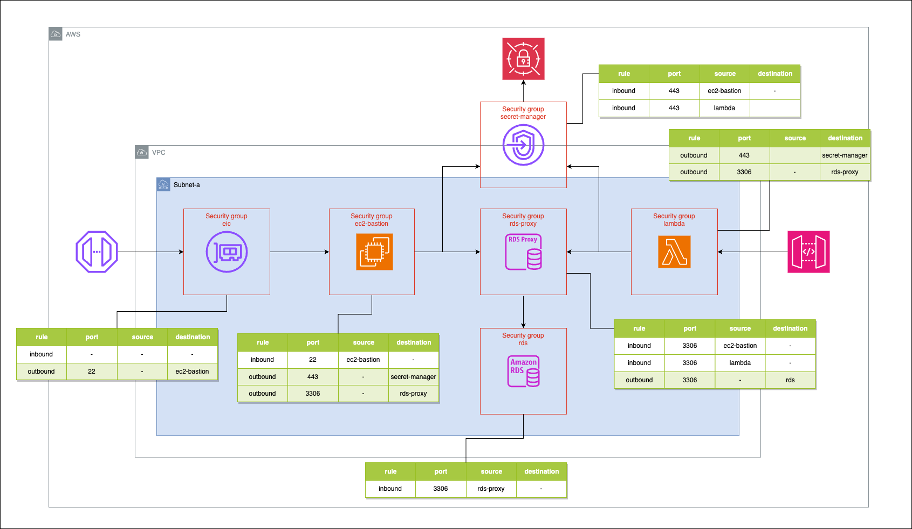

# AWS システム構成図

## 概要

## ネットワーク

### セキュリティグループのルール

## 1. EIC Endpoint Security Group

| Type     | Resource       | From Port | To Port | Protocol | Description      |
|----------|----------------|-----------|---------|----------|------------------|
| Outbound | EC2 Bastion    | 22        | 22      | tcp      | Admin EC2 access |

## 2. EC2 Bastion Security Group

| Type     | Resource            | From Port | To Port | Protocol | Description           |
|----------|---------------------|-----------|---------|----------|-----------------------|
| Inbound  | EIC Endpoint        | 22        | 22      | tcp      | EIC endpoint access   |
| Outbound | DB Proxy            | 3306      | 3306    | tcp      | DB proxy access       |
| Outbound | Secret Manager      | 443       | 443     | tcp      | Secret Manager access |

## 3. DB Proxy Security Group

| Type     | Resource      | From Port | To Port | Protocol | Description           |
|----------|---------------|-----------|---------|----------|-----------------------|
| Inbound  | EC2 Bastion   | 3306      | 3306    | tcp      | Admin traffic         |
| Inbound  | Lambda        | 3306      | 3306    | tcp      | Lambdas               |
| Outbound | RDS           | 3306      | 3306    | tcp      | DB connections        |

## 4. RDS Security Group

| Type    | Resource   | From Port | To Port | Protocol | Description           |
|---------|------------|-----------|---------|----------|-----------------------|
| Inbound | DB Proxy   | 3306      | 3306    | tcp      | DB proxy connections  |

## 5. Lambda Security Group

| Type     | Resource        | From Port | To Port | Protocol | Description           |
|----------|-----------------|-----------|---------|----------|-----------------------|
| Outbound | Secret Manager  | 443       | 443     | tcp      | Secret Manager access |
| Outbound | DB Proxy        | 3306      | 3306    | tcp      | DB access             |

## 6. Secret Manager Security Group

| Type    | Resource        | From Port | To Port | Protocol | Description       |
|---------|-----------------|-----------|---------|----------|-------------------|
| Inbound | Lambda          | 443       | 443     | tcp      | Lambda access     |
| Inbound | EC2 Bastion     | 443       | 443     | tcp      | EC2 access        |
