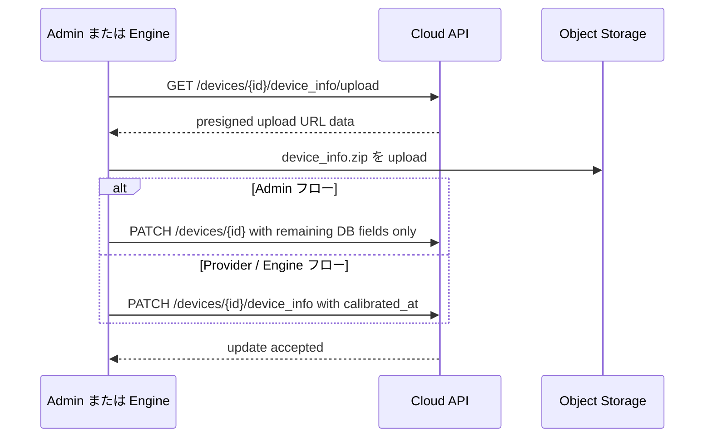

# デバイス情報の詳細

OQTOPUS は device_info の実体をオブジェクトストレージに保存し、API では inline JSON ではなく presigned URL 経由で参照します。
データベースには `device_type`, `status`, `n_qubits`, `calibrated_at` などのデバイスメタデータを保持し、実際の `device_info` payload はストレージ上の archive に置きます。

このページでは、現在動作しているバックエンドの挙動と、周辺クライアントで使われているストレージ上の慣例を説明します。内容は `backend/oas` 配下の OpenAPI と実装に沿っています。

## ストレージモデル

各デバイスは、決定的な storage key を 1 つ持ちます。

```text
devices/<device_id>/device_info.zip
```

オブジェクトキーはバックエンドで固定されています。クライアントは慣例として `device_info.json` を 1 つだけ含む zip をアップロードしますが、バックエンドが検証するのはオブジェクトキーであり、archive 内のファイル名ではありません。

| Object | 慣例上の zip 内エントリ名 | 作成者 | 利用者 | payload format | 備考 |
| --- | --- | --- | --- | --- | --- |
| `devices/<device_id>/device_info.zip` | `device_info.json` | Admin client, Provider, Engine | Admin, User, SDK | デバイス JSON payload | 現在 storage-backed なデバイス payload はこれだけです。 |

デフォルトのストレージドライバーは S3 です。
ローカル開発では `local` や `local:minio` も使えますが、API 契約は同じです。API は upload presigned URL data または download presigned URL を返し、クライアントは archive をストレージバックエンドへ直接転送します。

OpenAPI レベルでは、`device_info.zip` の中身の payload format は構造化 schema としては規定されていません。Admin 側の request model では `device_info` を JSON 文字列として扱い、read 側 API では `device_info` を presigned download URL を入れた文字列 field として返します。

## 読み出しモデル

Admin API と User API の `GET /devices` および `GET /devices/{device_id}` は、`devices/<device_id>/device_info.zip` が存在するときだけ `device_info` に download presigned URL を返します。
オブジェクトが存在しない場合、device row 自体が存在していても `device_info` は `null` になります。

バックエンドは storage key を `devices` table に保存しません。毎回 `device_id` から `devices/<device_id>/device_info.zip` を組み立てて参照します。

## DB 仕様

`devices` table は、現在のデバイス状態を表す metadata を保持します。`device_info` payload の実体は DB には保存せず、`device_id` から導出できる現在用 storage key に保存します。

| Column | 用途 |
| --- | --- |
| `id` | device identifier。現在用 storage key `devices/<device_id>/device_info.zip` の `<device_id>` としても使います。 |
| `device_type` | `QPU` または `simulator`。 |
| `status` | デバイスの公開状態。 |
| `n_qubits` | 現在の device row に表示する量子ビット数。 |
| `basis_gates` | JSON 文字列化した basis gate list。 |
| `instructions` | JSON 文字列化した supported instruction list。 |
| `calibrated_at` | 現在の device_info が確定された時刻。Provider の device_info 確定時に更新されます。 |
| `description` | デバイス説明。 |

`device_info_history` table は、過去の device_info snapshot を検索するための metadata だけを保持します。Provider API が履歴を発行するタイミングで、各 row にユニークな文字列 identifier を付与します。履歴 payload の実体も DB には保存せず、`device_id` と `calibrated_at` から決定的に導出される history storage key に保存します。

| Column | Type | Nullable | 用途 |
| --- | --- | --- | --- |
| `history_id` | varchar(36) | no | history row 発行時に付与するユニークな文字列。primary key であり、`GET /device_histories/{history_id}` の公開 identifier です。 |
| `device_id` | varchar(64) | no | device identifier。history storage key の一部です。この column には foreign key constraint を張りません。 |
| `calibrated_at` | timestamp / datetime | no | snapshot の有効時刻。history storage key の一部です。 |
| `n_qubits` | integer | no | snapshot 時点の量子ビット数。履歴一覧と履歴詳細ヘッダーで使います。 |
| `n_couplings` | integer | no | snapshot 時点の coupling 数。履歴一覧と履歴詳細ヘッダーで使います。 |
| `created_at` | timestamp / datetime | yes | row 作成時刻。 |
| `updated_at` | timestamp / datetime | yes | row 更新時刻。MySQL では `ON UPDATE CURRENT_TIMESTAMP`。 |

制約と index は次の通りです。

| Name | 内容 |
| --- | --- |
| Primary key | `history_id`。 |
| Unique constraint | `(device_id, calibrated_at)`。同じデバイス・同じ calibrated_at の snapshot は 1 件だけです。 |
| Foreign key | なし。device history の cleanup は application 側で明示的に行い、この table は snapshot identity で引ける小さな metadata table として保ちます。 |

`device_info_history` には `storage_key` column を持たせません。history object key は次の規則で一意に決まるため、DB に重複して保存しない方針です。

```text
devices/<device_id>/history/<calibrated_at in UTC YYYYMMDDTHHMMSSffffffZ>/device_info.zip
```

この key は実装上 `get_device_info_history_key(device_id, calibrated_at)` で生成します。DB row と storage object の対応は `(device_id, calibrated_at)` で表され、API は read 時に key を導出して object の存在確認と presigned URL 発行を行います。

Provider API の `PATCH /devices/{device_id}/device_info` は、upload 済み archive を現在用 key と history key の両方へ保存し、`devices.calibrated_at` を更新し、新しい `history_id` を付与して `device_info_history` に metadata row を追加します。この row は archived snapshot の lookup と概要表示に必要な metadata だけを保持し、device catalog metadata や運用状態は現在の `devices` row に残します。同じ `(device_id, calibrated_at)` が既に存在する場合は conflict として扱い、履歴 row は上書きしません。

User API と Admin API は、履歴を top-level resource として公開します。

- `GET /device_histories` は履歴 metadata の一覧を返します。query parameter として `device_id`, `from`, `to`, `limit`, `offset` を指定できます。
- `GET /device_histories/{history_id}` は、特定の履歴詳細と archived `device_info.zip` の presigned download URL を返します。

Admin API の `DELETE /devices/{device_id}` は、`devices` row を削除する前に matching する `device_info_history` rows を明示的に削除します。あわせて現在用 object と各 history object も削除し、DB だけ、または object storage だけが残る状態を避けます。

## Admin API の流れ

現在の Admin API は、storage-backed な 2 段階フローです。

1. DB 上の device row を登録または更新します。
   `POST /devices` は row を作成し、`PATCH /devices/{device_id}` は `status`, `n_qubits`, `description` などの DB-backed metadata を更新します。
2. `GET /devices/{device_id}/device_info/upload` で upload 先を取得します。
   バックエンドは `devices/<device_id>/device_info.zip` 用の presigned URL data を返します。
3. `device_info.zip` をストレージへ直接アップロードします。
4. 必要なら `PATCH /devices/{device_id}` で `calibrated_at` や `description` など残りの DB-backed metadata だけを更新します。
   `device_info.zip` 自体は upload が完了した時点で以後の read の source of truth になるため、admin client は `device_info` を PATCH body に載せ直す必要はありません。

現在の admin frontend は、先に `device_info.zip` を upload し、その後に必要な DB-backed field だけを PATCH します。

後方互換のため、`POST /devices` は request body 中の inline `device_info` JSON から `device_id` を抽出し続けます。ただし、その inline JSON 自体は読み出しモデルの source of truth として保存されません。登録後の API response が返す `device_info` は、常に storage-backed object の URL です。

更新シーケンス自体は短いですが、最後に使う API は Admin フローと Provider / Engine フローで異なります。



## Provider / Engine の流れ

Provider 側の upload も同じ storage convention を使いますが、確定用 endpoint は専用です。

1. Provider API の `GET /devices/{device_id}/device_info/upload` で upload 先を取得します。
2. `device_info.zip` をストレージへ直接アップロードします。
3. `PATCH /devices/{device_id}/device_info` に `calibrated_at` を渡して upload を確定します。

engine はこの flow を provider API 経由で使います。起動時に `DeviceGatewayFetcher` が device gateway から初回 fetch を行い、device repository update sequence を呼びます。device_info update が有効な場合、repository は次の順で処理します。

1. presigned upload 先を取得する
2. `devices/<device_id>/device_info.zip` を upload する
3. `PATCH /devices/{device_id}/device_info` に `calibrated_at` を渡す

起動後も、fetch した `device_info` payload または `calibrated_at` が変化したときに、同じ upload flow が再実行されます。

## 上書きと削除のセマンティクス

storage key は決定的なので、同じ `device_id` に対して新しい archive を upload すると前のオブジェクトを上書きします。最後に成功した upload が新しい source of truth になります。

Admin API の `DELETE /devices/{device_id}` は、次の両方を削除します。

- `devices` table の DB row
- 存在すれば `devices/<device_id>/device_info.zip` オブジェクト

これにより、device cleanup 時に孤立したストレージオブジェクトを残しません。

## アーカイブ構成の例

```text
devices/qulacs/device_info.zip
  device_info.json
```

## 実装メモ

- read 時の `device_info` は storage-backed です。API response は raw JSON ではなく download presigned URL を返します。
- OpenAPI では `device_info` 自体の型付き schema は定義していません。write 側の契約は実質的に「JSON を文字列化して渡す」、read 側の契約は「archive payload を指す URL 文字列を返す」です。
- Admin API の PATCH 契約は metadata 更新専用です。現在の admin client は `device_info.zip` を別途 upload し、`PATCH /devices/{device_id}` に `device_info` を載せ直しません。
- `calibrated_at` は引き続き `devices` table に保存され、オブジェクト upload 確定とは別に更新されます。
- upload presigned URL の有効期限は storage strategy に従います。現在の `FSSpecStorage` default は 1 時間です。
- バックエンドが検証するのは `device_info.zip` の存在であり、archive 内の entry 名ではありません。
- device row を再作成しても `device_info.zip` は復元されません。object を戻すには provider/admin の upload か、engine の起動時同期が必要です。
