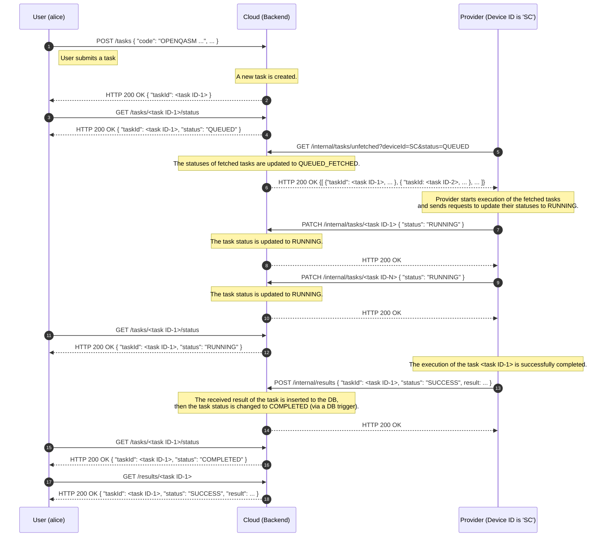
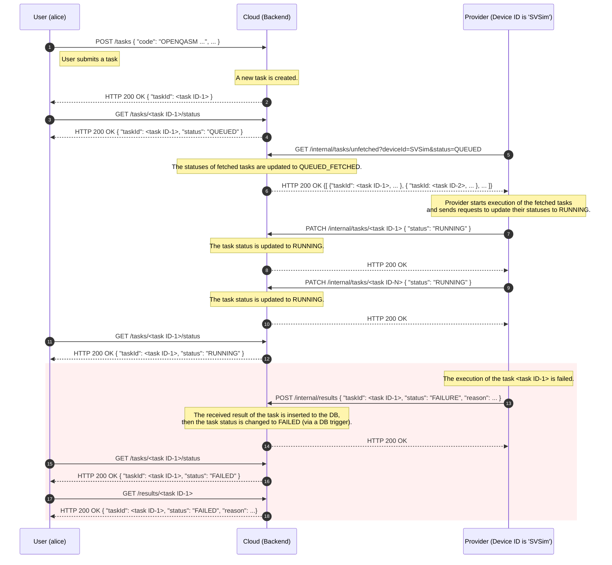
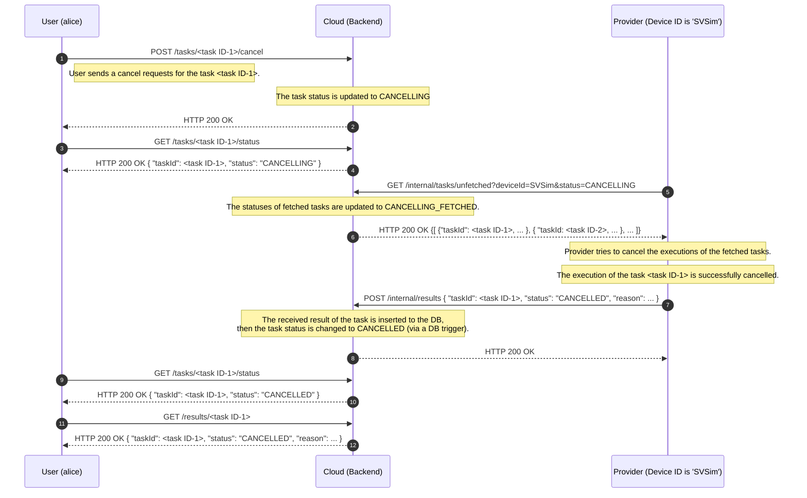

# タスク操作時のシーケンス

タスク操作時のシーケンスを以下に示します。
各シーケンスは、タスクの送信やキャンセルを行ってから操作が完了するまでの一連のステップを示しています。

> [!NOTE]
> シーケンス図中に記載している `/tasks`, `/tasks/{taskId}/cancel`, `/results` エンドポイントは、実際には sampling タスク用と estimation タスク用の別々のエンドポイントに分かれています。
> 例えば、`/tasks` であれば、`/tasks/sampling` と `/tasks/estimation` に分かれています。
> sampling タスク用と estimation タスク用の両エンドポイントでのシーケンスは共通のため、シーケンス図上ではパス中の `/sampling`, `/estimation` の部分を省略して記載しています。

## タスク実行のシーケンス (成功ケース)

タスクの実行が成功した場合のシーケンスを以下に示します。
User によるタスクの送信、Provider によるタスクのフェッチと実行、User による結果の取得の一連の流れを示しています。

Provider は定期的に、タスクのフェッチ・タスクの実行・実行結果の送信、の流れを繰り返します。
上図では 1 回分の流れを記載しています。

> [!NOTE]
> Cloud はフェッチ済みか否か (status の末尾に _FETCHED が付くか否か) の情報を Provider に対してのみ公開します。
> 例えば、ユーザーが QUEUED_FETCHED のタスク情報を Cloud から取得すると status は QUEUED になっており、Provider が取得すると status は QUEUED_FETCHED になっています。

### 各時点における DB 内のデータ

シーケンス図の各時点における、DB 内のデータのサンプルを以下に示します。  
`/tasks/sampling` と `/tasks/estimation` の 2 つのエンドポイントそれぞれに対して 1 回ずつタスクを送信した場合の例となっています。  
以下の数字は、シーケンス図中の丸数字と対応しています。

- (2)
  - tasks テーブル: [success-case-tasks-02.csv](../../sample/architecture/success-case-tasks-02.csv)
  - results テーブル: データ無し
- (6)
  - tasks テーブル: [success-case-tasks-06.csv](../../sample/architecture/success-case-tasks-06.csv)
  - results テーブル: データ無し
- (10)
  - tasks テーブル: [success-case-tasks-10.csv](../../sample/architecture/success-case-tasks-10.csv)
  - results テーブル: データ無し
- (14)
  - tasks テーブル: [success-case-tasks-14.csv](../../sample/architecture/success-case-tasks-14.csv)
  - results テーブル: [success-case-results-14.csv](../../sample/architecture/success-case-results-14.csv)

## タスク実行のシーケンス (失敗ケース)

タスクの実行に失敗した場合のシーケンスを以下に示します。
タスクの status が RUNNING に変化するまでは成功ケースと同様の流れです。図中の着色部分が、失敗した場合に特有の処理を示しています。

### 各時点における DB 内のデータ

シーケンス図の各時点における、DB 内のデータのサンプルを以下に示します。  
`/tasks/estimation` エンドポイントに対してタスクを送信した場合の例となっています。  
以下の数字は、シーケンス図中の丸数字と対応しています。

- (2), (6), (10)
  - 成功ケースの場合と同様であるため省略。
- (14)
  - tasks テーブル: [failure-case-tasks-14.csv](../../sample/architecture/failure-case-tasks-14.csv)
  - results テーブル: [failure-case-tasks-14.csv](../../sample/architecture/failure-case-results-14.csv)

## タスクキャンセルのシーケンス

タスクをキャンセルした際のシーケンス図を以下に示します。
QUEUED_FETCHED 状態のタスクが DB に存在する場合に、`/tasks/{taskId}/cancel` エンドポイントにリクエストを送った場合のシーケンスを示しています。

Provider は定期的に、キャンセルリクエスト (status が CANCELLING のタスク) のフェッチ・タスク実行のキャンセル・キャンセル結果の送信、の流れを繰り返します。
上図では 1 回分の流れを記載しています。

### 各時点における DB 内のデータ

シーケンス図の各時点における、DB 内のデータのサンプルを以下に示します。  
QUEUED_FETCHED 状態の sampling タスクが DB に存在する状態で、`/tasks/sampling/{taskId}/cancel` エンドポイントに対してリクエストした場合の例となっています。  
以下の数字は、シーケンス図中の丸数字と対応しています。

- (1)
  - tasks テーブル: [cancel-case-tasks-01.csv](../../sample/architecture/cancel-case-tasks-01.csv)
  - results テーブル: データ無し
- (2)
  - tasks テーブル: [cancel-case-tasks-02.csv](../../sample/architecture/cancel-case-tasks-02.csv)
  - results テーブル: データ無し
- (6)
  - tasks テーブル: [cancel-case-tasks-06.csv](../../sample/architecture/cancel-case-tasks-06.csv)
  - results テーブル: データ無し
- (8)
  - tasks テーブル: [cancel-case-tasks-08.csv](../../sample/architecture/cancel-case-tasks-08.csv)
  - results テーブル: [cancel-case-results-08.csv](../../sample/architecture/cancel-case-results-08.csv)

> [!NOTE]
> (1) の時点でタスクが QUEUED 状態 (Provider によりフェッチされる前の状態) の場合、Cloud は即座にタスクを CANCELLED 状態に変更します。
> 上記のシーケンス図だと、(1) から (8) の状態に即座に遷移することになります。
> この場合、Provider によってタスクがフェッチされることはありません。
