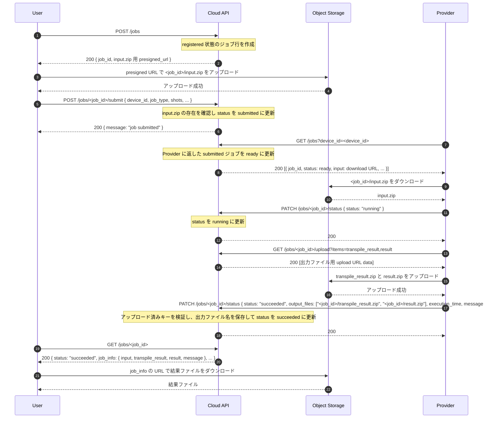
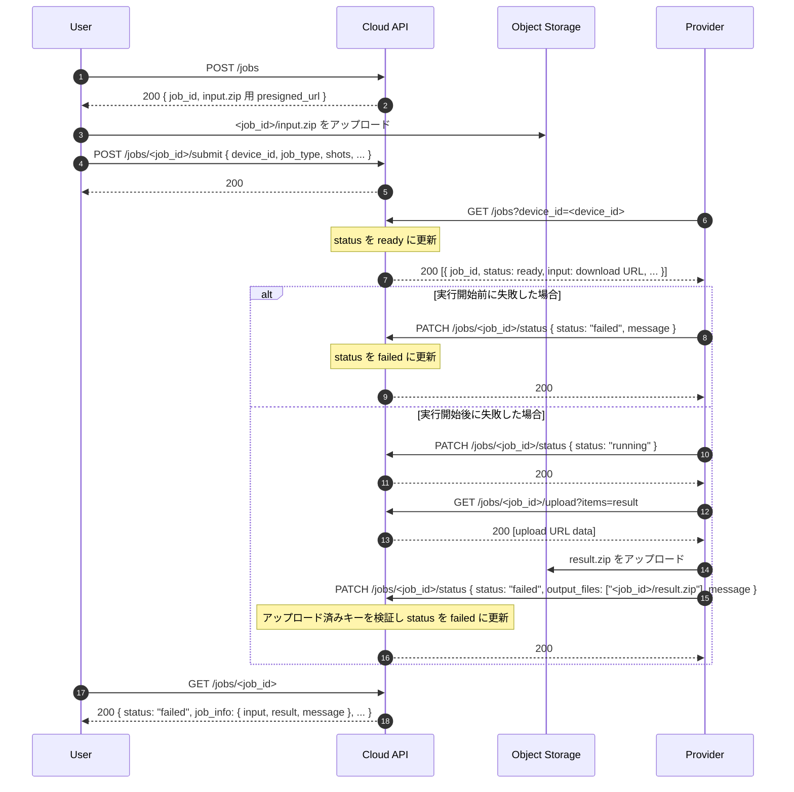
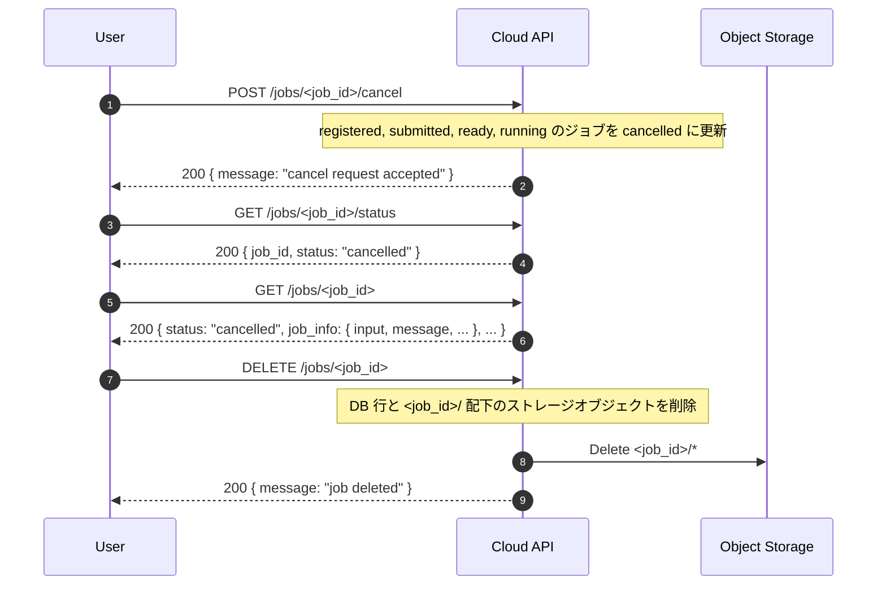

# ジョブ操作時のシーケンス

現在のジョブ操作シーケンスを示します。
大きなジョブ入出力は presigned URL を使ってオブジェクトストレージへ直接アップロードまたはダウンロードし、Cloud API はジョブのメタデータと状態を管理します。

## ジョブ実行のシーケンス (成功ケース)

```mermaid
sequenceDiagram
    autonumber
    participant User as User
    participant Cloud as Cloud API
    participant Storage as Object Storage
    participant Provider as Provider

    User->>Cloud: POST /jobs
    Note over Cloud: registered 状態のジョブ行を作成
    Cloud-->>User: 200 { job_id, input.zip 用 presigned_url }

    User->>Storage: presigned URL で <job_id>/input.zip をアップロード
    Storage-->>User: アップロード成功

    User->>Cloud: POST /jobs/<job_id>/submit { device_id, job_type, shots, ... }
    Note over Cloud: input.zip の存在を確認し status を submitted に更新
    Cloud-->>User: 200 { message: "job submitted" }

    Provider->>Cloud: GET /jobs?device_id=<device_id>
    Note over Cloud: Provider に返した submitted ジョブを ready に更新
    Cloud-->>Provider: 200 [{ job_id, status: ready, input: download URL, ... }]

    Provider->>Storage: <job_id>/input.zip をダウンロード
    Storage-->>Provider: input.zip

    Provider->>Cloud: PATCH /jobs/<job_id>/status { status: "running" }
    Note over Cloud: status を running に更新
    Cloud-->>Provider: 200

    Provider->>Cloud: GET /jobs/<job_id>/upload?items=transpile_result,result
    Cloud-->>Provider: 200 [出力ファイル用 upload URL data]

    Provider->>Storage: transpile_result.zip と result.zip をアップロード
    Storage-->>Provider: アップロード成功

    Provider->>Cloud: PATCH /jobs/<job_id>/status { status: "succeeded", output_files: ["<job_id>/transpile_result.zip", "<job_id>/result.zip"], execution_time, message }
    Note over Cloud: アップロード済みキーを検証し、出力ファイル名を保存して status を succeeded に更新
    Cloud-->>Provider: 200

    User->>Cloud: GET /jobs/<job_id>
    Cloud-->>User: 200 { status: "succeeded", job_info: { input, transpile_result, result, message }, ... }

    User->>Storage: job_info の URL で結果ファイルをダウンロード
    Storage-->>User: 結果ファイル
```

Provider が `GET /jobs` でジョブを取得すると、`submitted` のジョブは `ready` に進みます。
その後 Provider は明示的に `ready` から `running` へ更新し、出力ファイルをストレージへアップロードしてから、終端状態へ更新するときにアップロード済みキーを申告します。

## ジョブ実行のシーケンス (失敗ケース)

Provider が失敗を報告する直前までは成功ケースと同じ流れです。
Provider API は `ready` と `running` のどちらからでも `failed` への更新を受け付けるため、実行開始前の前処理失敗も報告できます。

```mermaid
sequenceDiagram
    autonumber
    participant User as User
    participant Cloud as Cloud API
    participant Storage as Object Storage
    participant Provider as Provider

    User->>Cloud: POST /jobs
    Cloud-->>User: 200 { job_id, input.zip 用 presigned_url }
    User->>Storage: <job_id>/input.zip をアップロード
    User->>Cloud: POST /jobs/<job_id>/submit { device_id, job_type, shots, ... }
    Cloud-->>User: 200

    Provider->>Cloud: GET /jobs?device_id=<device_id>
    Note over Cloud: status を ready に更新
    Cloud-->>Provider: 200 [{ job_id, status: ready, input: download URL, ... }]

    alt 実行開始前に失敗した場合
        Provider->>Cloud: PATCH /jobs/<job_id>/status { status: "failed", message }
        Note over Cloud: status を failed に更新
        Cloud-->>Provider: 200
    else 実行開始後に失敗した場合
        Provider->>Cloud: PATCH /jobs/<job_id>/status { status: "running" }
        Cloud-->>Provider: 200
        Provider->>Cloud: GET /jobs/<job_id>/upload?items=result
        Cloud-->>Provider: 200 [upload URL data]
        Provider->>Storage: result.zip をアップロード
        Provider->>Cloud: PATCH /jobs/<job_id>/status { status: "failed", output_files: ["<job_id>/result.zip"], message }
        Note over Cloud: アップロード済みキーを検証し status を failed に更新
        Cloud-->>Provider: 200
    end

    User->>Cloud: GET /jobs/<job_id>
    Cloud-->>User: 200 { status: "failed", job_info: { input, result, message }, ... }
```

失敗理由などの説明は `job_info.message` として返されます。
Provider が診断用の出力ファイルをアップロードし `output_files` に含めた場合、User API はそれらの download presigned URL も返します。

## ジョブキャンセルのシーケンス

```mermaid
sequenceDiagram
    autonumber
    participant User as User
    participant Cloud as Cloud API
    participant Storage as Object Storage

    User->>Cloud: POST /jobs/<job_id>/cancel
    Note over Cloud: registered, submitted, ready, running のジョブを cancelled に更新
    Cloud-->>User: 200 { message: "cancel request accepted" }

    User->>Cloud: GET /jobs/<job_id>/status
    Cloud-->>User: 200 { job_id, status: "cancelled" }

    User->>Cloud: GET /jobs/<job_id>
    Cloud-->>User: 200 { status: "cancelled", job_info: { input, message, ... }, ... }

    User->>Cloud: DELETE /jobs/<job_id>
    Note over Cloud: DB 行と <job_id>/ 配下のストレージオブジェクトを削除
    Cloud->>Storage: Delete <job_id>/*
    Cloud-->>User: 200 { message: "job deleted" }
```

User は `registered`, `submitted`, `ready`, `running` のジョブに対してキャンセルを要求できます。
削除できるのは `succeeded`, `failed`, `cancelled` の終端状態に到達したジョブだけです。
