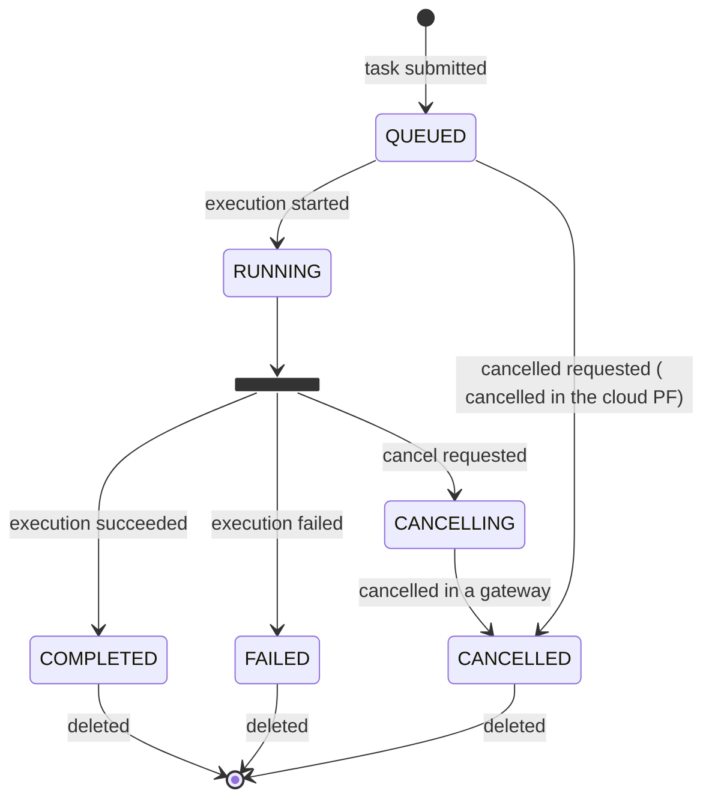

# タスクの状態遷移

RUNNING 状態に滞在する時間は非常に短いため、スキップされることがあります。例えば、QUEUED状態のタスクは直接 COMPLETED 状態に移行することがあります。

```mermaid
stateDiagram-v2
    [*] --> QUEUED :task submitted

    QUEUED --> RUNNING : execution started
    
    state join_state <<join>>
    RUNNING --> join_state
    
    state join_state <<fork>>
    join_state --> COMPLETED :execution succeeded
    join_state --> FAILED :execution failed
    join_state --> CANCELLING :cancel requested
    
    COMPLETED --> [*] :deleted
    FAILED --> [*] :deleted
    CANCELLING --> CANCELLED :cancelled in a gateway
    QUEUED --> CANCELLED :cancelled requested ( cancelled in the cloud PF)
    CANCELLED --> [*] :deleted
```

