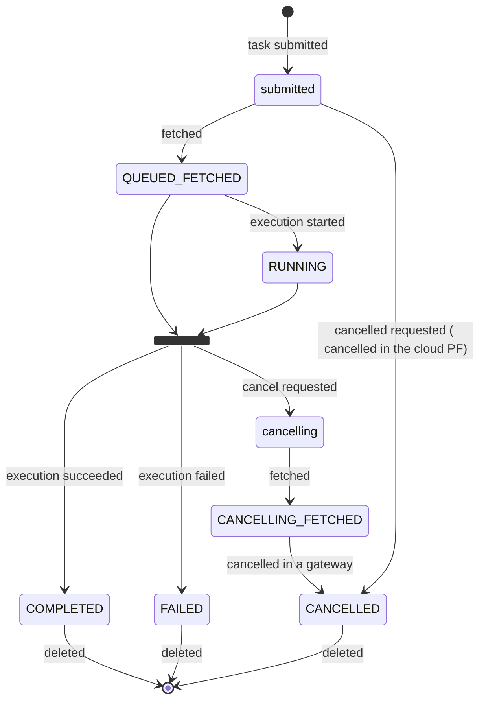

# タスクの状態遷移

RUNNING 状態に滞在する時間は非常に短いため、スキップされることがあります。例えば、QUEUED_FETCHED タスクは直接 COMPLETED 状態に移行することがあります。

```mermaid
stateDiagram-v2
    [*] --> submitted :task submitted

    submitted --> QUEUED_FETCHED :fetched
    QUEUED_FETCHED --> RUNNING : execution started
    
    state join_state <<join>>
    QUEUED_FETCHED --> join_state
    RUNNING --> join_state
    
    state join_state <<fork>>
    join_state --> COMPLETED :execution succeeded
    join_state --> FAILED :execution failed
    join_state --> cancelling :cancel requested
    
    COMPLETED --> [*] :deleted
    FAILED --> [*] :deleted
    cancelling --> CANCELLING_FETCHED :fetched
    CANCELLING_FETCHED --> CANCELLED :cancelled in a gateway
    submitted --> CANCELLED :cancelled requested ( cancelled in the cloud PF)
    CANCELLED --> [*] :deleted
```

