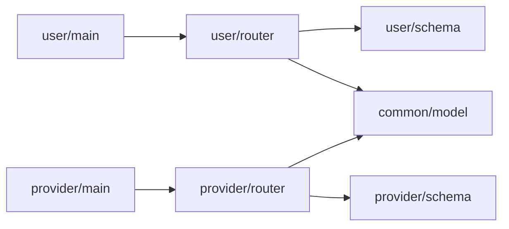

# バックエンド

## 採用技術

oqtopusでは、以下の技術を採用しています。

- FastAPI
- Uvicorn
- Mangum
- AWS Powertools
- Pydantic
- datamodel-code-generator
- SQLAlchemy

### FastAPI & Uvicorn & Mangum

WSGIサーバーとして、Uvicornを採用しています。Uvicornは、ASGIサーバーであるため、FastAPIとの親和性が高く、高速なリクエスト処理が可能です。
Mangumを利用することで、FastAPIアプリケーションをAWS Lambdaにデプロイすることができます。

### AWS Powertools

AWS Powertoolsは、AWS Lambdaのログを構造化するためのライブラリであり、ログの可視化や分析を容易にします。

### Pydantic & datamodel-code-generator

Pydanticは、データバリデーションライブラリであり、FastAPIのリクエストボディやレスポンスボディのバリデーションに利用されます。

datamodel-code-generatorは、OpenAPI仕様書からPydanticモデルを自動生成するためのライブラリであり、データモデルの定義を簡素化します。

### SQLAlchemy

SQLAlchemyは、PythonのORMライブラリであり、データベースの操作を簡素化します。

## コードの依存関係

以下の図は、Pythonプロジェクトのコードの依存関係を示しています。



エントリーポイントである`main.py`はFastAPIの`router`機能を利用して、routers配下のパスオペレーションにリクエストをルーティングします。

routerは、schemaで定義されたリクエストボディやレスポンスボディを使用して、リクエストのバリデーションを行います。databaseは、modelで定義されたデータモデルを使用して、データベースの操作を行います。

コードの依存関係をシンプルに保つために、以下のルールに従ってください。

- `main.py`は、`router`のみを参照する
- `schema`は、`router`でのみ利用される
- `schema`と`model`は常に参照されるのみで、他のコードに依存しない

> [!NOTE]
> schemaは[datamodel-code-generator](https://koxudaxi.github.io/datamodel-code-generator/)によって自動生成されるため、手動で変更しないでください。
> 詳しくは、[OpenAPI仕様書](openapi.md)を参照してください。

## リンター・フォーマッタ

oqtopusでは、以下のリンター・フォーマッタを利用しています。

| ツール | ドキュメント |
|-------|--------------|
| ruff  | [リンク](https://docs.astral.sh/ruff/) |
| black | [リンク](https://black.readthedocs.io/en/stable/) |
| mypy  | [リンク](https://mypy.readthedocs.io/en/stable/) |

それぞれ、以下のようにタスクランナーをMakefileに定義しているので、コードをPushする前に実行してください。

```makefile
# ./Makefile
fmt:
 @poetry run black .

lint:
 @poetry run ruff check .

test:fmt lint
 @poetry run pytest -vv --cov
```

## チュートリアル

それでは、簡単な例を通じて、APIの開発フローを確認しましょう。

### 要件

- タスクIDを指定して、タスクを一つ取得するAPIを作成する

このように、OpenAPI仕様書からPydanticモデルを自動生成することで、仕様書との乖離を防ぎ、APIの開発を効率化することができます。
それでは、APIの実装を行いましょう。

### routerの実装

`backend/oqtopus_cloud/user/router/task.py`に、タスクIDを指定して、タスクを一つ取得するAPIの実装を行います。

```python
# backend/oqtopus_cloud/user/router/task.py
import uuid

from aws_lambda_powertools import Logger
from fastapi import (
    APIRouter,
    Depends,
    Path,
)
from pydantic import (
    ValidationError,
)
from sqlalchemy.orm import (
    Session,
)

from oqtopus_cloud.common.database.device import exist_device
from oqtopus_cloud.common.database.session import (
    get_db,
)
from oqtopus_cloud.common.database.task import (
    Task,
    TaskNotFound,
    fetch_task,
    insert_task,
)
from oqtopus_cloud.user.schemas.errors import BadRequest, InternalServerError, NotFoundError
from oqtopus_cloud.user.schemas.task import (
    GetTaskResponse,
    PostTaskRequest,
    TaskId,
)

router = APIRouter()


logger = Logger(service="mangum")
logger.setLevel("INFO")

# ...省略

@router.get("/task/{task_id}")
def get_task(
    task_id: str = Path(
        title="The uuid of the task to get",
        description="The uuid of the task to get",
        examples="e8a60c14-8838-46c9-816a-30191d6ab517",
    ),
    db: Session = Depends(get_db),
):
    """
    Get a task by its ID.

    Args:
        task_id (str, optional): The UUID of the task to get.
        db (Session, optional): The database session.

    Raises:
        BadRequest: If the task ID is invalid.
        NotFoundError: If the task is not found with the given id.
        InternalServerError: If an unexpected error occurs.

    Returns:
        GetTaskResponse: The task response object.
    """

    try:
        TaskId(root=task_id)
    except ValidationError:
        logger.info(f"invalid task id: {task_id}")
        raise BadRequest(detail="invalid task id")
    except Exception as e:
        logger.info(f"error: {str(e)}")
        raise InternalServerError(detail=str(e))

    try:
        task = fetch_task(
            db,
            task_id,
        )
        return GetTaskResponse(
            task_id=task.id,
            code=task.code,
            device=task.device,
            n_qubits=task.n_qubits,
            n_nodes=task.n_nodes,
            skip_transpilation=task.skip_transpilation,
            seed_transpilation=task.seed_transpilation,
            seed_simulation=task.seed_simulation,
            ro_error_mitigation=task.ro_error_mitigation,
            n_per_node=task.n_per_node,
        )
    except TaskNotFound:
        logger.info(f"task not found with the given id: {task_id}")
        raise NotFoundError(detail="task not found with the given id")
    except Exception as e:
        logger.info(f"error: {str(e)}")
        raise InternalServerError(detail=str(e))
```

routerには、`/task/{task_id}`のエンドポイントを定義しています。
このエンドポイントは、`task_id`をパスパラメータとして受け取り、`GetTaskResponse`を返します。

「コードの依存関係」の章でも記載しましたが、routerではschemaで定義されたリクエストボディやレスポンスボディを使用して、リクエストのバリデーションを行い、databaseに定義した関数を使用して、データベースの操作を行います。ロジックもrouter内に記述することで、コードの依存関係をシンプルに保ちます。

> [!WARNING]
> router内でのデータベース操作は、databaseに定義された関数を使用し。router内で直接データベース操作を行うことは避けてください。
> database↔schema、schema↔modelには依存関係を持たせないようにしてください。

> [!NOTE]
> DocstringはGoogleスタイルに従って記述してください。詳しくは、[Googleスタイルガイド](https://sphinxcontrib-napoleon.readthedocs.io/en/latest/example_google.html)を参照してください。
> VSCodeを使用している場合は、[Google Docstring Generator](https://marketplace.visualstudio.com/items?itemName=njpwerner.autodocstring)をインストールすることで、Docstringを自動生成することができます。
> また、Copilotを使用している場合は、`ドキュメントを生成`を選択することで、Docstringを自動生成することができます。

では、実装が完了したので、テストを行いましょう。

### テスト

TODO: テストの実装について記載する。
