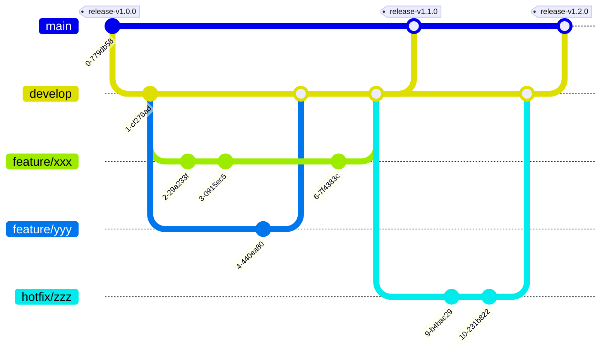

# 開発フロー

## ブランチ戦略

以下の図のように、`main` ブランチから `develop` ブランチを分岐させ、`develop` ブランチから `feature/xxx` ブランチを分岐させて開発を行います。
`main`ブランチはリリース用のブランチであり、`develop`ブランチは開発用のブランチです。

`develop`ブランチは常に最新のコードがマージされている状態を保たれているため、hotfixを行う際も、`develop`ブランチから分岐させて修正を行います。



### ブランチ名

明確なルールは設けませんが、以下のような命名規則を推奨します。

- `feature/xxx`: (xxxは機能追加の内容)
- `bugfix/xxx`: （xxxはバグ修正の内容）
- `hotfix/xxx`: (xxxは緊急修正の内容)

## コミットメッセージ

コミットメッセージは[Conventional Commits](https://www.conventionalcommits.org/en/v1.0.0/)に従うことが望ましいです。

### コミットメッセージのフォーマット

.gitmessageを利用することでコミットメッセージのテンプレートを提供します。
これは`git config --local`に設定することで、本プロジェクト内でのみ有効になります。

```bash
git config --local commit.template .gitmessage
```

この設定を行うことで、`git commit`を実行した際に`.gitmessage`の内容がエディタ(デフォルトではVim)に表示されます。

```bash
git commit
# Overview (Uncomment one of the following templates)
#feat: 
# └  A new feature
#fix:
# └  A bug fix
#docs:
# └  Documentation only changes
#style:
# └  Changes that do not affect the meaning of the code
#    (white-space, formatting, missing semi-colons, etc)
#refactor:
# └  A code change that neither fixes a bug nor adds a featur
#test:
# └  Adding missing or correcting existing tests
#ci:
# └  Changes to our CI configuration files and scripts
#chore:
# └  Updating grunt tasks etc; no production code change

```

適切なテンプレートを選択し、コメントアウトをはずしてコミットメッセージを記述してください。

```bash
docs: Update README.md
# └  Documentation only changes
```

## コミットメッセージとラベルの対応

`develop`ブランチへのPRを作成するときにコミットメッセージからラベルを自動で付与するように設定しています。
以下、プレフィックスとラベルの対応です。

|　プレフィックス | ラベル | 説明|
|---|---|---|
|feat: | `feature` | 新機能の追加|
|fix: | `bugfix` | バグの修正|
|docs: | `documentation` | ドキュメントのみの変更|
|style: | `style` | コードの意味に影響を与えない変更（空白、フォーマット、セミコロンの欠落など）|
|refactor: | `refactor` | バグの修正や機能の追加を行わないコードの変更|
|test: | `test` | テストの追加、修正|
|ci: | `ci` | CIの追加、修正|
|chore: | `chore` | 些末な変更 |

### マージ

以下の原則に従ってマージを行います。

- `main`←`develop`のマージは、Create a merge commitを選択してマージします。
- `develop`←`feature/xxx`のマージは、Squash and mergeを選択してマージします。

> [!NOTE]
> 上記のようにマージを行うことで、煩雑なコミットが`main`ブランチに残らないため、履歴がシンプルになり、リリース時のトラブルを防ぐことができます。

