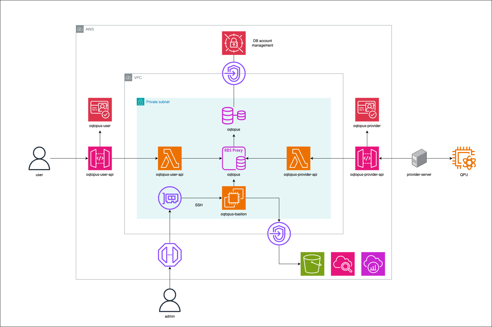

<h1> 🐙 OQTOPUS Cloud </h1>

<table>
  <thead>
    <tr>
      <th style="text-align:center"><a href="../">🇺🇸English</a></th>
      <th style="text-align:center"><a href="../jp/">🇯🇵日本語</a></th>
    </tr>
  </thead>
</table>

  

## 概要

**O**pen **Q**uantum **T**oolchain for **OP**erators & **US**ers (**OQTOPUS**) は クラウド量子コンピュータのアーキテクチャをOSSとして提供するプロジェクトです。
[@oqtopus-team](https://github.com/oqtopus-team)が提供している各種OSSと連携して利用することで、クラウド量子コンピュータシステムを構築することができます。

## 機能

- **Quantum Computing as a Service (QCaaS)**: クラウド量子コンピュータシステムを提供します。
- **Quantum Task Management**: 量子タスクとその状態を管理します。
- **Quatntum Device Management**: 量子デバイスとその状態を管理します。

## ドキュメント

### アーキテクチャ

- [AWSシステム構成図](./architecture/aws_system_architecture_diagram.md)
- [シーケンス図](./architecture/sequence_diagram.md)
- [タスクの状態遷移図](./architecture/task_state_transition_diagram.md)

### 開発者ガイド

- [開発フロー](./developer_guidelines/index.md)
- [開発環境のセットアップ](./developer_guidelines/setup.md)
- [OpenAPI 仕様書によるコード生成](./developer_guidelines/openapi.md)
- [バックエンドの実装](./developer_guidelines/backend.md)
- [Terraformガイドライン](./developer_guidelines/terraform_guidelines.md)
- [Terraform Modules](./terraform_modules/README.md)
- [DBスキーマ](./schema/README.md)
- [FAQ](./ja/developer_guidelines/faq.md)

### OpenAPI仕様書

- [User API](./oas/user/openapi.yaml)
- [Provider API](./oas/provider/openapi.yaml)

### 運用

- [初期設定](./operation/setup.md)
- [デプロイメント](./operation/deployment.md)

### その他

- [コントリビュートの方法](./CONTRIBUTING.md)
- [行動規範](./CODE_OF_CONDUCT.md)
- [セキュリティ](./SECURITY.md)

## 引用

OQTOPUS Cloudを研究に引用する際には、以下のDOIをご利用いただけます。

引用情報は[CITATION](https://github.com/oqtopus-team/oqtopus-cloud/blob/main/CITATION.cff)ファイルにも記載されています。

## お問い合わせ

このリポジトリで問題が発生した場合は、Issueもしくは以下のメールアドレスにお問い合わせください。

- [oqtopus-team[at]googlegroups.com](mailto:oqtopus-team[at]googlegroups.com)

## ライセンス

OQTOPUS Cloud は [Apache License 2.0](https://github.com/oqtopus-team/oqtopus-cloud/blob/main/LICENSE) の下でリリースされています。
