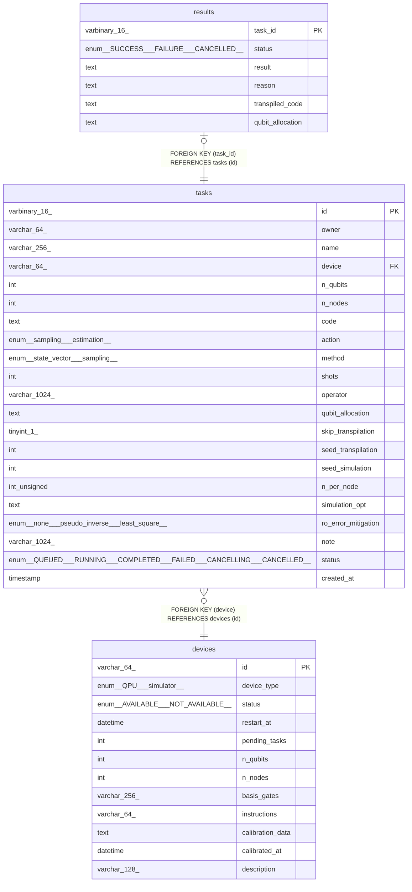

# main

## Tables

| Name | Columns | Comment | Type |
| ---- | ------- | ------- | ---- |
| [devices](devices.md) | 12 |  | BASE TABLE |
| [results](results.md) | 6 |  | BASE TABLE |
| [tasks](tasks.md) | 21 |  | BASE TABLE |

## Relations

---

> Generated by [tbls](https://github.com/k1LoW/tbls)
