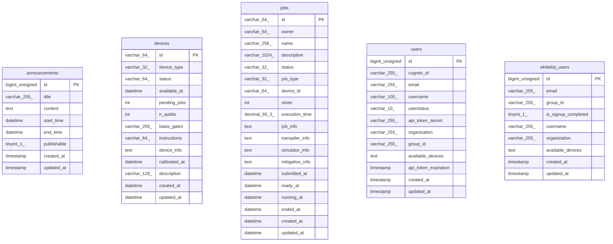

# main

## Tables

| Name | Columns | Comment | Type |
| ---- | ------- | ------- | ---- |
| [announcements](announcements.md) | 8 |  | BASE TABLE |
| [devices](devices.md) | 13 |  | BASE TABLE |
| [jobs](jobs.md) | 19 |  | BASE TABLE |
| [users](users.md) | 12 |  | BASE TABLE |
| [whitelist_users](whitelist_users.md) | 9 |  | BASE TABLE |

## Relations

```mermaid
erDiagram


"announcements" {
  bigint_unsigned id PK
  varchar_255_ title
  text content
  datetime start_time
  datetime end_time
  tinyint_1_ publishable
  timestamp created_at
  timestamp updated_at
}
"devices" {
  varchar_64_ id PK
  varchar_32_ device_type
  varchar_64_ status
  datetime available_at
  int pending_jobs
  int n_qubits
  varchar_256_ basis_gates
  varchar_64_ instructions
  text device_info
  datetime calibrated_at
  varchar_128_ description
  datetime created_at
  datetime updated_at
}
"jobs" {
  varchar_64_ id PK
  varchar_64_ owner
  varchar_256_ name
  varchar_1024_ description
  varchar_32_ status
  varchar_32_ job_type
  varchar_64_ device_id
  int shots
  decimal_65_3_ execution_time
  text job_info
  text transpiler_info
  text simulator_info
  text mitigation_info
  datetime submitted_at
  datetime ready_at
  datetime running_at
  datetime ended_at
  datetime created_at
  datetime updated_at
}
"users" {
  bigint_unsigned id PK
  varchar_255_ cognito_id
  varchar_255_ email
  varchar_100_ username
  varchar_10_ userstatus
  varchar_255_ api_token_secret
  varchar_255_ organization
  varchar_255_ group_id
  text available_devices
  timestamp api_token_expiration
  timestamp created_at
  timestamp updated_at
}
"whitelist_users" {
  bigint_unsigned id PK
  varchar_255_ email
  varchar_255_ group_id
  tinyint_1_ is_signup_completed
  varchar_255_ username
  varchar_255_ organization
  text available_devices
  timestamp created_at
  timestamp updated_at
}
```

---

> Generated by [tbls](https://github.com/k1LoW/tbls)
