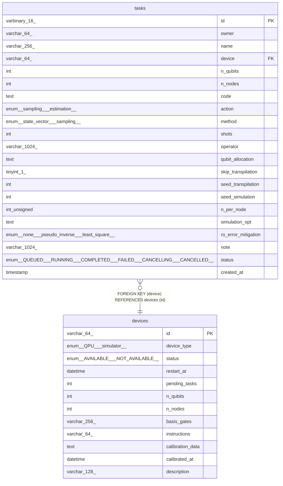

# devices

## Description

<details>
<summary><strong>Table Definition</strong></summary>

```sql
CREATE TABLE `devices` (
  `id` varchar(64) COLLATE utf8mb4_unicode_ci NOT NULL,
  `device_type` enum('QPU','simulator') COLLATE utf8mb4_unicode_ci NOT NULL,
  `status` enum('AVAILABLE','NOT_AVAILABLE') COLLATE utf8mb4_unicode_ci NOT NULL DEFAULT 'NOT_AVAILABLE',
  `restart_at` datetime DEFAULT NULL,
  `pending_tasks` int NOT NULL DEFAULT '0',
  `n_qubits` int NOT NULL,
  `n_nodes` int DEFAULT NULL,
  `basis_gates` varchar(256) COLLATE utf8mb4_unicode_ci NOT NULL,
  `instructions` varchar(64) COLLATE utf8mb4_unicode_ci NOT NULL,
  `calibration_data` text COLLATE utf8mb4_unicode_ci,
  `calibrated_at` datetime DEFAULT NULL,
  `description` varchar(128) COLLATE utf8mb4_unicode_ci NOT NULL,
  PRIMARY KEY (`id`)
) ENGINE=InnoDB DEFAULT CHARSET=utf8mb4 COLLATE=utf8mb4_unicode_ci
```

</details>

## Columns

| Name | Type | Default | Nullable | Children | Parents | Comment |
| ---- | ---- | ------- | -------- | -------- | ------- | ------- |
| id | varchar(64) |  | false | [tasks](tasks.md) |  |  |
| device_type | enum('QPU','simulator') |  | false |  |  |  |
| status | enum('AVAILABLE','NOT_AVAILABLE') | NOT_AVAILABLE | false |  |  |  |
| restart_at | datetime |  | true |  |  |  |
| pending_tasks | int | 0 | false |  |  |  |
| n_qubits | int |  | false |  |  |  |
| n_nodes | int |  | true |  |  |  |
| basis_gates | varchar(256) |  | false |  |  |  |
| instructions | varchar(64) |  | false |  |  |  |
| calibration_data | text |  | true |  |  |  |
| calibrated_at | datetime |  | true |  |  |  |
| description | varchar(128) |  | false |  |  |  |

## Constraints

| Name | Type | Definition |
| ---- | ---- | ---------- |
| PRIMARY | PRIMARY KEY | PRIMARY KEY (id) |

## Indexes

| Name | Definition |
| ---- | ---------- |
| PRIMARY | PRIMARY KEY (id) USING BTREE |

## Relations



---

## Sample Data

See [here](../sample/schema/devices.csv).

> Generated by [tbls](https://github.com/k1LoW/tbls)
