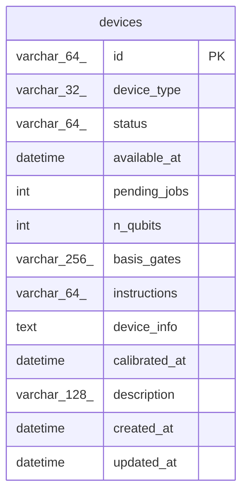

# devices

## Description

<details>
<summary><strong>Table Definition</strong></summary>

```sql
CREATE TABLE `devices` (
  `id` varchar(64) COLLATE utf8mb4_unicode_ci NOT NULL,
  `device_type` varchar(32) COLLATE utf8mb4_unicode_ci NOT NULL DEFAULT 'QPU',
  `status` varchar(64) COLLATE utf8mb4_unicode_ci NOT NULL DEFAULT 'available',
  `available_at` datetime DEFAULT NULL,
  `pending_jobs` int NOT NULL DEFAULT '0',
  `n_qubits` int NOT NULL DEFAULT '1',
  `basis_gates` varchar(256) COLLATE utf8mb4_unicode_ci NOT NULL,
  `instructions` varchar(64) COLLATE utf8mb4_unicode_ci NOT NULL,
  `device_info` text COLLATE utf8mb4_unicode_ci,
  `calibrated_at` datetime DEFAULT NULL,
  `description` varchar(128) COLLATE utf8mb4_unicode_ci NOT NULL,
  `created_at` datetime DEFAULT CURRENT_TIMESTAMP,
  `updated_at` datetime DEFAULT CURRENT_TIMESTAMP ON UPDATE CURRENT_TIMESTAMP,
  PRIMARY KEY (`id`)
) ENGINE=InnoDB DEFAULT CHARSET=utf8mb4 COLLATE=utf8mb4_unicode_ci
```

</details>

## Columns

| Name | Type | Default | Nullable | Extra Definition | Children | Parents | Comment |
| ---- | ---- | ------- | -------- | ---------------- | -------- | ------- | ------- |
| id | varchar(64) |  | false |  |  |  |  |
| device_type | varchar(32) | QPU | false |  |  |  |  |
| status | varchar(64) | available | false |  |  |  |  |
| available_at | datetime |  | true |  |  |  |  |
| pending_jobs | int | 0 | false |  |  |  |  |
| n_qubits | int | 1 | false |  |  |  |  |
| basis_gates | varchar(256) |  | false |  |  |  |  |
| instructions | varchar(64) |  | false |  |  |  |  |
| device_info | text |  | true |  |  |  |  |
| calibrated_at | datetime |  | true |  |  |  |  |
| description | varchar(128) |  | false |  |  |  |  |
| created_at | datetime | CURRENT_TIMESTAMP | true | DEFAULT_GENERATED |  |  |  |
| updated_at | datetime | CURRENT_TIMESTAMP | true | DEFAULT_GENERATED on update CURRENT_TIMESTAMP |  |  |  |

## Constraints

| Name | Type | Definition |
| ---- | ---- | ---------- |
| PRIMARY | PRIMARY KEY | PRIMARY KEY (id) |

## Indexes

| Name | Definition |
| ---- | ---------- |
| PRIMARY | PRIMARY KEY (id) USING BTREE |

## Relations


```mermaid
erDiagram


"devices" {
  varchar_64_ id PK
  varchar_32_ device_type
  varchar_64_ status
  datetime available_at
  int pending_jobs
  int n_qubits
  varchar_256_ basis_gates
  varchar_64_ instructions
  text device_info
  datetime calibrated_at
  varchar_128_ description
  datetime created_at
  datetime updated_at
}
```

---

## Sample Data

See [here](../sample/schema/devices.csv).

> Generated by [tbls](https://github.com/k1LoW/tbls)
