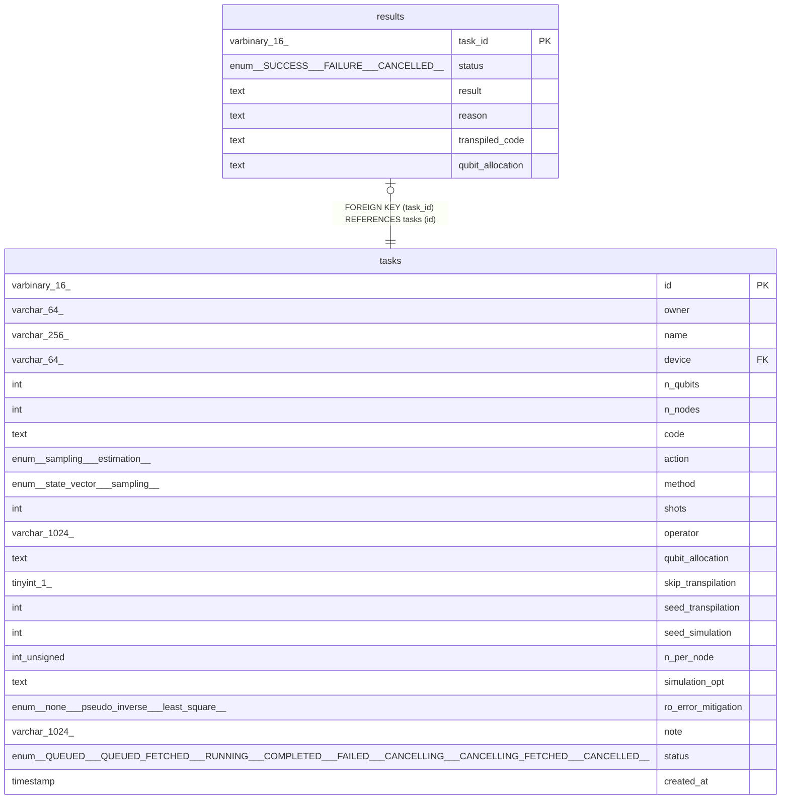

# results

## Description

<details>
<summary><strong>Table Definition</strong></summary>

```sql
CREATE TABLE `results` (
  `task_id` varbinary(16) NOT NULL,
  `status` enum('SUCCESS','FAILURE','CANCELLED') COLLATE utf8mb4_unicode_ci NOT NULL,
  `result` text COLLATE utf8mb4_unicode_ci,
  `reason` text COLLATE utf8mb4_unicode_ci,
  `transpiled_code` text COLLATE utf8mb4_unicode_ci,
  `qubit_allocation` text COLLATE utf8mb4_unicode_ci,
  PRIMARY KEY (`task_id`),
  CONSTRAINT `results_ibfk_1` FOREIGN KEY (`task_id`) REFERENCES `tasks` (`id`) ON DELETE CASCADE
) ENGINE=InnoDB DEFAULT CHARSET=utf8mb4 COLLATE=utf8mb4_unicode_ci
```

</details>

## Columns

| Name | Type | Default | Nullable | Children | Parents | Comment |
| ---- | ---- | ------- | -------- | -------- | ------- | ------- |
| task_id | varbinary(16) |  | false |  | [tasks](tasks.md) |  |
| status | enum('SUCCESS','FAILURE','CANCELLED') |  | false |  |  |  |
| result | text |  | true |  |  |  |
| reason | text |  | true |  |  |  |
| transpiled_code | text |  | true |  |  |  |
| qubit_allocation | text |  | true |  |  |  |

## Constraints

| Name | Type | Definition |
| ---- | ---- | ---------- |
| PRIMARY | PRIMARY KEY | PRIMARY KEY (task_id) |
| results_ibfk_1 | FOREIGN KEY | FOREIGN KEY (task_id) REFERENCES tasks (id) |

## Indexes

| Name | Definition |
| ---- | ---------- |
| PRIMARY | PRIMARY KEY (task_id) USING BTREE |

## Triggers

| Name | Definition |
| ---- | ---------- |
| update_tasks_status_trigger | CREATE TRIGGER update_tasks_status_trigger AFTER INSERT ON results<br>FOR EACH ROW<br>BEGIN<br>	IF NEW.status = 'SUCCESS' THEN<br>  		UPDATE main.tasks SET status = 'COMPLETED' WHERE id = NEW.task_id;<br>  	ELSEIF NEW.status = 'FAILURE' THEN<br>  		UPDATE main.tasks SET status = 'FAILED' WHERE id = NEW.task_id;<br>  	ELSEIF NEW.status = 'CANCELLED' THEN<br>  		UPDATE main.tasks SET status = 'CANCELLED' WHERE id = NEW.task_id;<br>  	END IF;<br>END |

## Relations



---

## Sample Data

See [here](../sample/schema/results.csv).

> Generated by [tbls](https://github.com/k1LoW/tbls)
