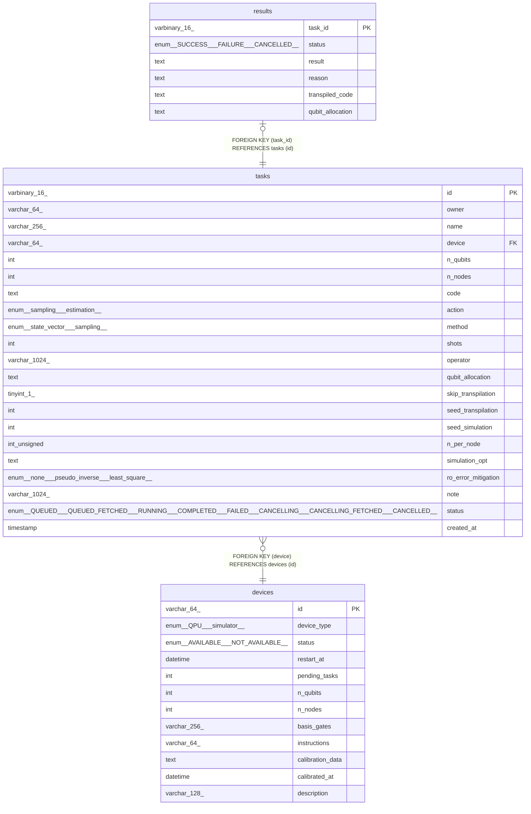

# tasks

## Description

<details>
<summary><strong>Table Definition</strong></summary>

```sql
CREATE TABLE `tasks` (
  `id` varbinary(16) NOT NULL,
  `owner` varchar(64) COLLATE utf8mb4_unicode_ci NOT NULL,
  `name` varchar(256) COLLATE utf8mb4_unicode_ci DEFAULT NULL,
  `device` varchar(64) COLLATE utf8mb4_unicode_ci NOT NULL,
  `n_qubits` int DEFAULT NULL,
  `n_nodes` int DEFAULT NULL,
  `code` text COLLATE utf8mb4_unicode_ci NOT NULL,
  `action` enum('sampling','estimation') COLLATE utf8mb4_unicode_ci NOT NULL,
  `method` enum('state_vector','sampling') COLLATE utf8mb4_unicode_ci DEFAULT NULL,
  `shots` int DEFAULT NULL,
  `operator` varchar(1024) COLLATE utf8mb4_unicode_ci DEFAULT NULL,
  `qubit_allocation` text COLLATE utf8mb4_unicode_ci,
  `skip_transpilation` tinyint(1) NOT NULL DEFAULT '0',
  `seed_transpilation` int DEFAULT NULL,
  `seed_simulation` int DEFAULT NULL,
  `n_per_node` int unsigned DEFAULT NULL,
  `simulation_opt` text COLLATE utf8mb4_unicode_ci,
  `ro_error_mitigation` enum('none','pseudo_inverse','least_square') COLLATE utf8mb4_unicode_ci DEFAULT NULL,
  `note` varchar(1024) COLLATE utf8mb4_unicode_ci DEFAULT NULL,
  `status` enum('submitted','QUEUED_FETCHED','RUNNING','COMPLETED','FAILED','cancelling','CANCELLING_FETCHED','CANCELLED') COLLATE utf8mb4_unicode_ci NOT NULL DEFAULT 'submitted',
  `created_at` timestamp NULL DEFAULT CURRENT_TIMESTAMP,
  PRIMARY KEY (`id`),
  KEY `device` (`device`),
  CONSTRAINT `tasks_ibfk_1` FOREIGN KEY (`device`) REFERENCES `devices` (`id`)
) ENGINE=InnoDB DEFAULT CHARSET=utf8mb4 COLLATE=utf8mb4_unicode_ci
```

</details>

## Columns

| Name | Type | Default | Nullable | Extra Definition | Children | Parents | Comment |
| ---- | ---- | ------- | -------- | ---------------- | -------- | ------- | ------- |
| id | varbinary(16) |  | false |  | [results](results.md) |  |  |
| owner | varchar(64) |  | false |  |  |  |  |
| name | varchar(256) |  | true |  |  |  |  |
| device | varchar(64) |  | false |  |  | [devices](devices.md) |  |
| n_qubits | int |  | true |  |  |  |  |
| n_nodes | int |  | true |  |  |  |  |
| code | text |  | false |  |  |  |  |
| action | enum('sampling','estimation') |  | false |  |  |  |  |
| method | enum('state_vector','sampling') |  | true |  |  |  |  |
| shots | int |  | true |  |  |  |  |
| operator | varchar(1024) |  | true |  |  |  |  |
| qubit_allocation | text |  | true |  |  |  |  |
| skip_transpilation | tinyint(1) | 0 | false |  |  |  |  |
| seed_transpilation | int |  | true |  |  |  |  |
| seed_simulation | int |  | true |  |  |  |  |
| n_per_node | int unsigned |  | true |  |  |  |  |
| simulation_opt | text |  | true |  |  |  |  |
| ro_error_mitigation | enum('none','pseudo_inverse','least_square') |  | true |  |  |  |  |
| note | varchar(1024) |  | true |  |  |  |  |
| status | enum('submitted','QUEUED_FETCHED','RUNNING','COMPLETED','FAILED','cancelling','CANCELLING_FETCHED','CANCELLED') | submitted | false |  |  |  |  |
| created_at | timestamp | CURRENT_TIMESTAMP | true | DEFAULT_GENERATED |  |  |  |

## Constraints

| Name | Type | Definition |
| ---- | ---- | ---------- |
| PRIMARY | PRIMARY KEY | PRIMARY KEY (id) |
| tasks_ibfk_1 | FOREIGN KEY | FOREIGN KEY (device) REFERENCES devices (id) |

## Indexes

| Name | Definition |
| ---- | ---------- |
| device | KEY device (device) USING BTREE |
| PRIMARY | PRIMARY KEY (id) USING BTREE |

## Relations



---

## Sample Data

See [here](../sample/schema/tasks.csv).

> Generated by [tbls](https://github.com/k1LoW/tbls)
